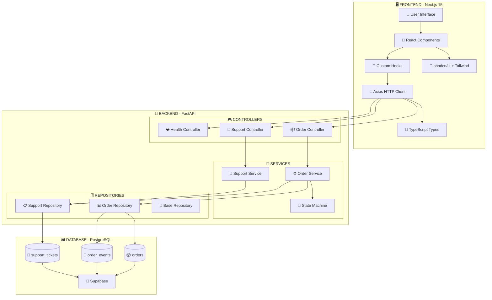
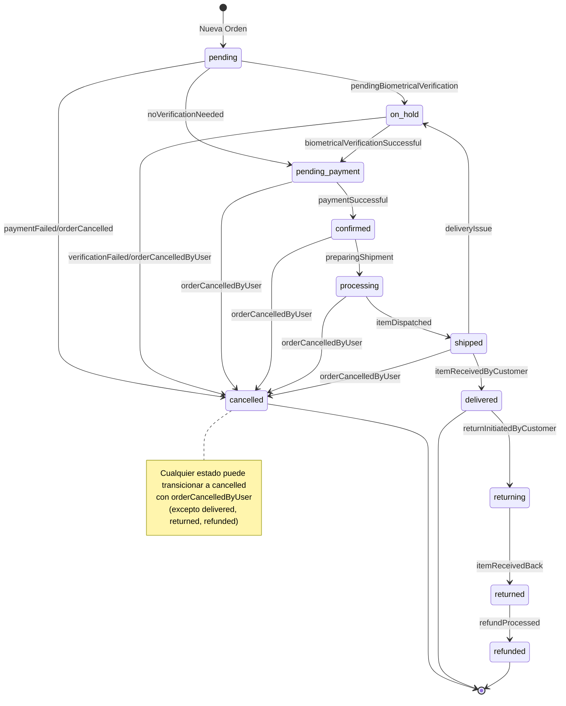
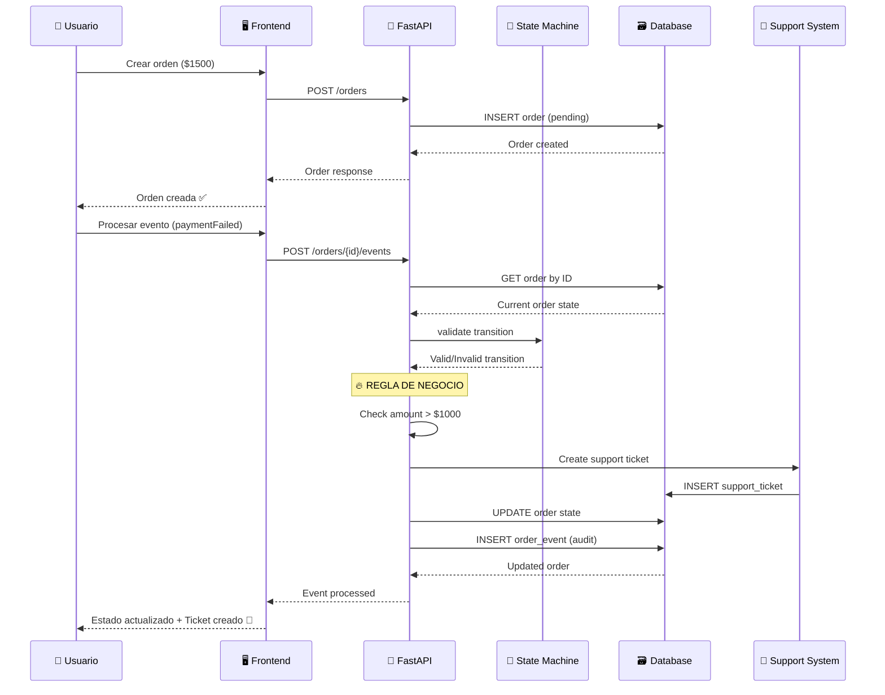
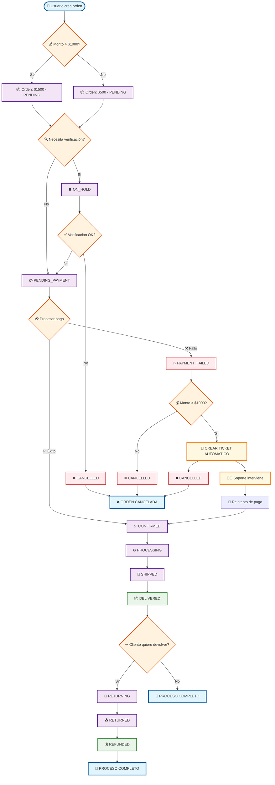
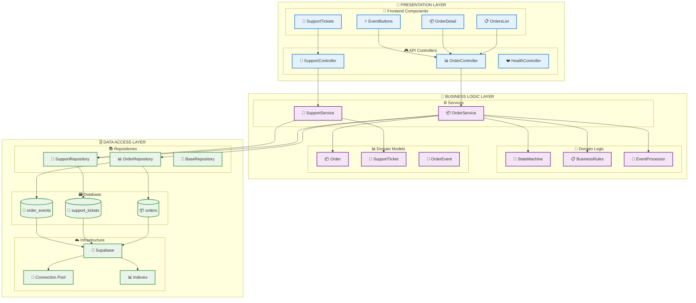
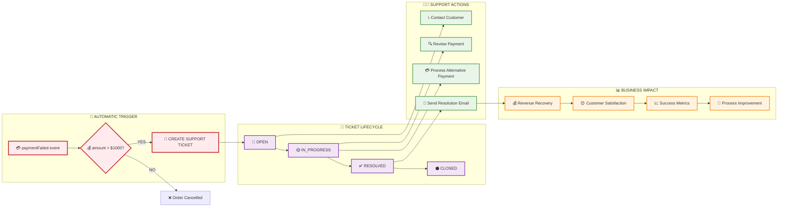
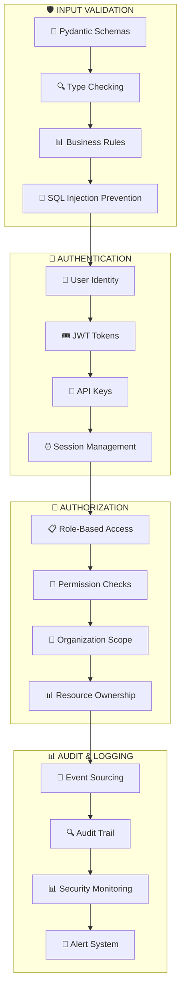

# 🏗️ Diagrama Completo del Sistema Sainapsis

## 📊 Arquitectura General del Sistema

## 🔄 Máquina de Estados Completa

## 🔄 Flujo de Datos Completo

## 📊 Flujo de Datos de una Orden Real

## 🏗️ Arquitectura de 3 Capas Detallada

## 🎯 Sistema de Support Tickets Automático

## 🔐 Seguridad y Validación

## 📈 Performance y Escalabilidad

```mermaid
graph LR
    %% === FRONTEND OPTIMIZATION ===
    subgraph "🚀 FRONTEND PERFORMANCE"
        F1[⚡ Next.js SSR/SSG]
        F2[📦 Code Splitting]
        F3[🖼️ Image Optimization]
        F4[💾 Browser Caching]
    end
    
    %% === BACKEND OPTIMIZATION ===
    subgraph "⚙️ BACKEND PERFORMANCE"
        B1[🔄 Async/Await]
        B2[🏊 Connection Pooling]
        B3[📊 Query Optimization]
        B4[🗜️ Response Compression]
    end
    
    %% === DATABASE OPTIMIZATION ===
    subgraph "🗃️ DATABASE PERFORMANCE"
        D1[📊 Strategic Indexes]
        D2[🔄 Query Optimization]
        D3[📈 Connection Scaling]
        D4[🗂️ Partitioning]
    end
    
    %% === CACHING STRATEGY ===
    subgraph "💾 CACHING LAYERS"
        C1[🌐 CDN Caching]
        C2[🖥️ Browser Cache]
        C3[🚀 Application Cache]
        C4[🗃️ Database Cache]
    end
    
    %% === MONITORING ===
    subgraph "📊 MONITORING"
        M1[📈 Performance Metrics]
        M2[🚨 Error Tracking]
        M3[📊 Usage Analytics]
        M4[⏱️ Response Times]
    end
    
    %% === CONNECTIONS ===
    F1 --> F2 --> F3 --> F4
    B1 --> B2 --> B3 --> B4
    D1 --> D2 --> D3 --> D4
    C1 --> C2 --> C3 --> C4
    M1 --> M2 --> M3 --> M4
    
    F4 -.-> B1
    B4 -.-> D1
    D4 -.-> C1
    C4 -.-> M1
```

---

## 🎯 Resumen Visual del Sistema

Este diagrama completo muestra cómo tu sistema Sainapsis integra:

1. **🖥️ Frontend Moderno** - Next.js 15 con React 19
2. **🚀 Backend Robusto** - FastAPI con arquitectura de 3 capas
3. **🤖 State Machine** - Control preciso de estados de órdenes
4. **🎫 Support Automático** - Tickets creados automáticamente
5. **🗃️ Persistencia Confiable** - PostgreSQL con Supabase
6. **🔐 Seguridad Integral** - Validación y autenticación
7. **📈 Performance Optimizada** - Cacheo y optimizaciones
8. **📊 Monitoreo Completo** - Métricas y alertas

El sistema es una **arquitectura empresarial de clase mundial** que maneja el ciclo completo de órdenes de forma automática, segura y escalable.