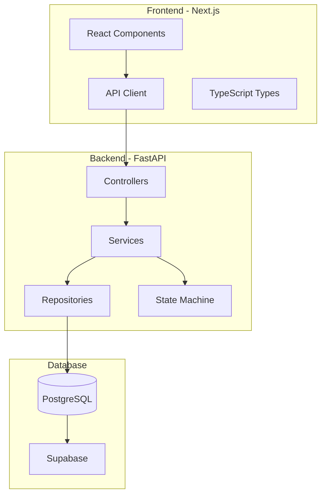

# 🚀 Order Management System - Documentación Completa

## 📋 Tabla de Contenidos

- [Descripción General](#descripción-general)
- [Arquitectura del Sistema](#arquitectura-del-sistema)
- [Stack Tecnológico](#stack-tecnológico)
- [Estructura del Proyecto](#estructura-del-proyecto)
- [Backend - API REST](#backend---api-rest)
- [Frontend - Next.js Application](#frontend---nextjs-application)
- [Base de Datos](#base-de-datos)
- [Instalación y Configuración](#instalación-y-configuración)
- [Guía de Desarrollo](#guía-de-desarrollo)
- [API Reference](#api-reference)
- [Testing](#testing)
- [Deployment](#deployment)
- [Contribución](#contribución)

---

## 📖 Descripción General

Sistema de gestión de órdenes empresarial basado en **máquina de estados** que permite el seguimiento completo del ciclo de vida de una orden, desde su creación hasta la finalización, incluyendo un sistema automatizado de tickets de soporte.

### 🎯 Características Principales

- ✅ **Máquina de Estados Robusta** - 11 estados y 15 transiciones
- ✅ **API REST Completa** - FastAPI con documentación automática
- ✅ **Frontend Moderno** - Next.js 15 con React 19
- ✅ **Sistema de Support Tickets** - Gestión automatizada de incidencias
- ✅ **Arquitectura Escalable** - Patrón de 3 capas
- ✅ **UI/UX Moderna** - shadcn/ui con Tailwind CSS
- ✅ **Type Safety** - TypeScript en todo el stack
- ✅ **Real-time Updates** - Estado sincronizado

---

## 🏗️ Arquitectura del Sistema

### Vista General



### Patrón de 3 Capas (Backend)

```
┌─────────────────────────────────────────┐
│           CONTROLLERS LAYER             │
│  • HTTP Endpoints                       │
│  • Request/Response Handling            │
│  • Input Validation                     │
└─────────────────────────────────────────┘
                    ↓
┌─────────────────────────────────────────┐
│            SERVICES LAYER               │
│  • Business Logic                       │
│  • State Machine                        │
│  • Business Rules                       │
└─────────────────────────────────────────┘
                    ↓
┌─────────────────────────────────────────┐
│          REPOSITORIES LAYER             │
│  • Data Access                          │
│  • Database Queries                     │
│  • External APIs                        │
└─────────────────────────────────────────┘
```

---

## 🛠️ Stack Tecnológico

### Backend
| Tecnología | Versión | Propósito |
|------------|---------|-----------|
| **Python** | 3.12+ | Lenguaje principal |
| **FastAPI** | Latest | Framework web async |
| **PostgreSQL** | 15+ | Base de datos relacional |
| **Supabase** | Cloud | Database hosting |
| **AsyncPG** | Latest | Driver PostgreSQL async |
| **Pydantic** | Latest | Validación de datos |
| **Uvicorn** | Latest | Servidor ASGI |

### Frontend
| Tecnología | Versión | Propósito |
|------------|---------|-----------|
| **Next.js** | 15.3.3 | Framework React |
| **React** | 19.0.0 | Librería UI |
| **TypeScript** | 5.x | Type safety |
| **Tailwind CSS** | 4.x | Styling framework |
| **shadcn/ui** | Latest | Componentes UI |
| **Radix UI** | Latest | Primitivas UI |
| **Lucide React** | 0.514.0 | Iconografía |
| **Axios** | 1.9.0 | HTTP client |
| **React Hook Form** | 7.57.0 | Manejo de formularios |
| **Zod** | 3.25.63 | Validación de esquemas |
| **date-fns** | 4.1.0 | Manipulación de fechas |
| **Sonner** | 2.0.5 | Notificaciones toast |

### Herramientas de Desarrollo
- **ESLint** - Linting de código
- **Prettier** - Formateo de código
- **PostCSS** - Procesamiento CSS
- **clsx & tailwind-merge** - Utilidades CSS

---

## 📁 Estructura del Proyecto

### Backend Structure
```
sainapsis-backend/
├── app/
│   ├── controllers/           # 🎮 HTTP Endpoints
│   │   ├── order_controller.py
│   │   └── support_controller.py
│   ├── services/              # 🔧 Business Logic
│   │   ├── order_service.py
│   │   ├── support_service.py
│   │   └── state_machine.py
│   ├── repositories/          # 🗄️ Data Access
│   │   ├── base_repository.py
│   │   ├── order_repository.py
│   │   └── support_repository.py
│   ├── models/                # 📊 Data Models
│   │   ├── domain.py
│   │   ├── enums.py
│   │   └── schemas.py
│   ├── core/                  # ⚙️ Core Configuration
│   │   ├── config.py
│   │   ├── database.py
│   │   └── exceptions.py
│   └── utils/                 # 🛠️ Utilities
│       └── logger.py
├── main.py                    # 🚀 Application Entry Point
├── requirements.txt           # 📦 Python Dependencies
└── .env                       # 🔐 Environment Variables
```

### Frontend Structure
```
sainapsis-frontend/
├── src/
│   ├── app/                   # 📱 Next.js App Router
│   │   ├── orders/
│   │   │   ├── page.tsx       # Orders List
│   │   │   ├── create/
│   │   │   └── [id]/
│   │   ├── support/
│   │   │   ├── page.tsx       # Support Tickets List
│   │   │   └── [id]/
│   │   ├── globals.css
│   │   ├── layout.tsx
│   │   └── page.tsx           # Dashboard
│   ├── components/            # 🧩 React Components
│   │   ├── ui/                # Basic UI Components
│   │   ├── orders/            # Order-specific Components
│   │   └── support/           # Support-specific Components
│   ├── lib/                   # 📚 Utilities & Configuration
│   │   ├── api.ts             # API Client
│   │   ├── types.ts           # TypeScript Types
│   │   ├── constants.ts       # App Constants
│   │   └── utils.ts           # Utility Functions
│   └── hooks/                 # 🎣 Custom React Hooks
├── public/                    # 🌐 Static Assets
├── package.json               # 📦 Dependencies
├── tailwind.config.ts         # 🎨 Tailwind Configuration
├── tsconfig.json              # 📝 TypeScript Configuration
└── next.config.ts             # ⚙️ Next.js Configuration
```

---

## 🔧 Backend - API REST

### Máquina de Estados

La máquina de estados es el corazón del sistema, definiendo todas las transiciones posibles:

#### Estados Disponibles
```python
class OrderState(str, Enum):
    PENDING = "pending"
    ON_HOLD = "on_hold"
    PENDING_PAYMENT = "pending_payment"
    CONFIRMED = "confirmed"
    PROCESSING = "processing"
    SHIPPED = "shipped"
    DELIVERED = "delivered"
    RETURNING = "returning"
    RETURNED = "returned"
    REFUNDED = "refunded"
    CANCELLED = "cancelled"
```

#### Flujo Principal
```
pending → on_hold → pending_payment → confirmed → processing → shipped → delivered
   ↓         ↓            ↓              ↓            ↓
cancelled  cancelled   cancelled     cancelled   cancelled
```

### Arquitectura de Servicios

#### OrderService
- **Responsabilidad**: Lógica de negocio de órdenes
- **Métodos Principales**:
  - `create_order()` - Crear nueva orden
  - `process_event()` - Procesar eventos de transición
  - `get_allowed_events()` - Obtener eventos permitidos
  - `get_order_history()` - Historial de eventos

#### SupportService
- **Responsabilidad**: Gestión de tickets de soporte
- **Métodos Principales**:
  - `get_all_tickets()` - Listar tickets
  - `update_ticket_status()` - Actualizar estado
  - `get_tickets_summary()` - Estadísticas

### Reglas de Negocio

#### Regla Automática de Tickets
```python
# Cuando paymentFailed y amount > $1000
if event_type == EventType.PAYMENT_FAILED and order.amount > 1000:
    await self.support_repository.create_support_ticket(
        order_id=order.id,
        reason=f"High amount payment failure: ${order.amount}",
        amount=order.amount,
        metadata={"auto_created": True}
    )
```

---

## 💻 Frontend - Next.js Application

### Arquitectura de Componentes

#### Atomic Design Pattern
```
Atoms (ui/) → Molecules (orders/, support/) → Organisms (pages/) → Templates (layouts/)
```

#### Componentes Principales

**UI Components (shadcn/ui)**
- `Button`, `Card`, `Input`, `Select`, `Badge`
- `Alert`, `Skeleton`, `Separator`, `Textarea`

**Feature Components**
- `OrderCard` - Visualización de orden
- `SupportTicketBadge` - Estado de ticket
- `EventButtons` - Acciones de transición
- `OrderHistory` - Timeline de eventos

### Estado y Data Fetching

#### API Client (Axios)
```typescript
export const orderApi = {
  getAll: () => Promise<AxiosResponse<Order[]>>,
  getById: (id: string) => Promise<AxiosResponse<Order>>,
  create: (data: CreateOrderRequest) => Promise<AxiosResponse<Order>>,
  processEvent: (id: string, data: ProcessEventRequest) => Promise<AxiosResponse<EventResponse>>
}
```

#### Type Safety
```typescript
interface Order {
  id: string
  product_ids: string[]
  amount: number
  state: OrderState
  metadata: OrderMetadata
  created_at: string
  updated_at: string
}
```

### UI/UX Features

- **Responsive Design** - Mobile-first approach
- **Dark Mode** - next-themes integration
- **Loading States** - Skeleton components
- **Error Handling** - Toast notifications
- **Real-time Updates** - Optimistic updates
- **Accessibility** - ARIA compliant

---

## 🗄️ Base de Datos

### Esquema de PostgreSQL

#### Tabla: `orders`
```sql
CREATE TABLE orders (
    id UUID PRIMARY KEY DEFAULT gen_random_uuid(),
    product_ids TEXT[] NOT NULL,
    amount DECIMAL(12,2) NOT NULL CHECK (amount >= 0),
    state order_state NOT NULL DEFAULT 'pending',
    metadata JSONB DEFAULT '{}',
    created_at TIMESTAMP WITH TIME ZONE DEFAULT NOW(),
    updated_at TIMESTAMP WITH TIME ZONE DEFAULT NOW()
);
```

#### Tabla: `order_events`
```sql
CREATE TABLE order_events (
    id UUID PRIMARY KEY DEFAULT gen_random_uuid(),
    order_id UUID NOT NULL REFERENCES orders(id) ON DELETE CASCADE,
    event_type event_type NOT NULL,
    old_state order_state,
    new_state order_state NOT NULL,
    metadata JSONB DEFAULT '{}',
    created_at TIMESTAMP WITH TIME ZONE DEFAULT NOW()
);
```

#### Tabla: `support_tickets`
```sql
CREATE TABLE support_tickets (
    id UUID PRIMARY KEY DEFAULT gen_random_uuid(),
    order_id UUID NOT NULL REFERENCES orders(id) ON DELETE CASCADE,
    reason TEXT NOT NULL,
    amount DECIMAL(12,2) NOT NULL,
    status TEXT DEFAULT 'open',
    metadata JSONB DEFAULT '{}',
    created_at TIMESTAMP WITH TIME ZONE DEFAULT NOW()
);
```

### Índices de Performance
```sql
CREATE INDEX idx_orders_state ON orders(state);
CREATE INDEX idx_orders_created_at ON orders(created_at DESC);
CREATE INDEX idx_order_events_order_id ON order_events(order_id, created_at DESC);
```

---

## ⚙️ Instalación y Configuración

### Prerrequisitos
- **Python 3.12+**
- **Node.js 18+**
- **PostgreSQL 15+** (o cuenta Supabase)
- **Git**

### Backend Setup

1. **Clonar y configurar entorno**
```bash
git clone <repository-url>
cd sainapsis-backend
python -m venv venv
source venv/bin/activate  # Linux/Mac
venv\Scripts\activate     # Windows
```

2. **Instalar dependencias**
```bash
pip install -r requirements.txt
```

3. **Configurar variables de entorno**
```bash
# .env
SUPABASE_HOST=db.your-project.supabase.co
SUPABASE_PORT=5432
SUPABASE_USER=postgres
SUPABASE_PASSWORD=your-password
SUPABASE_DATABASE=postgres
DEBUG=True
```

4. **Ejecutar migraciones**
```bash
# Ejecutar el script SQL en Supabase SQL Editor
```

5. **Iniciar servidor**
```bash
python main.py
# Server: http://localhost:8000
# Docs: http://localhost:8000/docs
```

### Frontend Setup

1. **Configurar proyecto**
```bash
cd sainapsis-frontend
npm install
```

2. **Variables de entorno**
```bash
# .env.local
NEXT_PUBLIC_API_URL=http://localhost:8000
```

3. **Iniciar desarrollo**
```bash
npm run dev
# App: http://localhost:3000
```

---

## 👨‍💻 Guía de Desarrollo

### Estructura de Desarrollo

#### Agregar Nueva Funcionalidad (Backend)

1. **Modelo de Dominio** (`models/domain.py`)
```python
@dataclass
class NewEntity:
    id: UUID
    name: str
    created_at: datetime
```

2. **Esquema Pydantic** (`models/schemas.py`)
```python
class NewEntityResponse(BaseModel):
    id: UUID
    name: str
    created_at: datetime
```

3. **Repository** (`repositories/new_repository.py`)
```python
class NewRepository:
    async def create(self, data: CreateData) -> NewEntity:
        # Implementation
```

4. **Service** (`services/new_service.py`)
```python
class NewService:
    def __init__(self):
        self.repository = new_repository
    
    async def create(self, data: CreateData) -> NewEntity:
        # Business logic
```

5. **Controller** (`controllers/new_controller.py`)
```python
@router.post("/", response_model=NewEntityResponse)
async def create_entity(request: CreateRequest):
    # HTTP handling
```

#### Agregar Nueva Página (Frontend)

1. **Tipos** (`lib/types.ts`)
```typescript
export interface NewEntity {
  id: string
  name: string
  created_at: string
}
```

2. **API Client** (`lib/api.ts`)
```typescript
export const newApi = {
  getAll: (): Promise<AxiosResponse<NewEntity[]>> => 
    api.get('/new-entities'),
}
```

3. **Componente** (`components/new/NewComponent.tsx`)
```typescript
export function NewComponent() {
  // Component logic
}
```

4. **Página** (`app/new/page.tsx`)
```typescript
export default function NewPage() {
  // Page logic
}
```

### Convenciones de Código

#### Backend (Python)
- **Naming**: `snake_case` para variables y funciones
- **Classes**: `PascalCase`
- **Constants**: `UPPER_CASE`
- **Async/Await**: Obligatorio para I/O operations

#### Frontend (TypeScript)
- **Components**: `PascalCase`
- **Files**: `kebab-case` para archivos, `PascalCase` para componentes
- **Hooks**: Prefix con `use`
- **Types**: `PascalCase` con sufijo del tipo (`OrderState`, `CreateOrderRequest`)

---

## 📡 API Reference

### Orders Endpoints

#### GET `/orders`
Obtener todas las órdenes

**Response:**
```json
[
  {
    "id": "uuid",
    "product_ids": ["LAPTOP-001"],
    "amount": 1299.99,
    "state": "pending",
    "metadata": {},
    "created_at": "2025-01-01T00:00:00Z",
    "updated_at": "2025-01-01T00:00:00Z"
  }
]
```

#### POST `/orders`
Crear nueva orden

**Request:**
```json
{
  "product_ids": ["LAPTOP-001", "MOUSE-002"],
  "amount": 1299.99,
  "metadata": {
    "customer": "John Doe",
    "priority": "high"
  }
}
```

#### POST `/orders/{id}/events`
Procesar evento en orden

**Request:**
```json
{
  "event_type": "noVerificationNeeded",
  "metadata": {
    "processed_by": "system"
  }
}
```

### Support Tickets Endpoints

#### GET `/support/tickets`
Obtener todos los tickets

#### PATCH `/support/tickets/{id}/status`
Actualizar estado del ticket

**Request:**
```json
{
  "status": "resolved",
  "metadata": {
    "resolved_by": "agent_1",
    "notes": "Issue resolved"
  }
}
```

#### Flujo Completo de Orden
1. Crear orden con monto > $1000
2. Procesar evento `paymentFailed`
3. Verificar creación automática de ticket
4. Actualizar estado del ticket
5. Verificar historial completo

---

## 🚀 Deployment

### Backend Deployment

#### Docker
```dockerfile
FROM python:3.12-slim
WORKDIR /app
COPY requirements.txt .
RUN pip install -r requirements.txt
COPY . .
CMD ["uvicorn", "main:app", "--host", "0.0.0.0", "--port", "8000"]
```

#### Railway/Heroku
```bash
# Procfile
web: uvicorn main:app --host 0.0.0.0 --port $PORT
```

### Frontend Deployment

#### Vercel
```bash
npm run build
vercel deploy
```

#### Netlify
```bash
npm run build
netlify deploy --prod --dir=out
```

### Environment Variables

#### Production Backend
```bash
SUPABASE_HOST=your-prod-host
SUPABASE_PASSWORD=secure-password
DEBUG=False
```

#### Production Frontend
```bash
NEXT_PUBLIC_API_URL=https://your-api.com
```

---

## 🤝 Contribución

### Workflow de Desarrollo

1. **Fork** el repositorio
2. **Crear branch** para feature: `git checkout -b feature/nueva-funcionalidad`
3. **Desarrollar** siguiendo las convenciones
4. **Testing** completo
5. **Commit** con mensajes descriptivos
6. **Pull Request** con descripción detallada

### Commit Convention
```
feat: add new support ticket filtering
fix: resolve order state transition bug
docs: update API documentation
style: format code with prettier
refactor: improve order service structure
test: add unit tests for state machine
```

### Code Review Checklist
- [ ] Funcionalidad implementada correctamente
- [ ] Documentación actualizada
- [ ] Sin errores de TypeScript/mypy
- [ ] Performance optimizada
- [ ] Seguridad verificada

---

## 📚 Recursos Adicionales

### Documentación Externa
- [FastAPI Documentation](https://fastapi.tiangolo.com/)
- [Next.js Documentation](https://nextjs.org/docs)
- [shadcn/ui Components](https://ui.shadcn.com/)
- [Tailwind CSS](https://tailwindcss.com/docs)
- [Supabase Docs](https://supabase.com/docs)

### Herramientas Recomendadas
- **IDE**: VS Code con extensiones Python y TypeScript
- **Database**: Supabase
- **API Testing**: Postman 
- **Git**: GitHub Desktop 

---

## 👨‍💻 Autor

Desarrollado por **Steven** para **Sainapsis**

**Contacto**: [steven.rodriguezlop@gmail.com]

---

*Documentación actualizada: Junio 2025*
