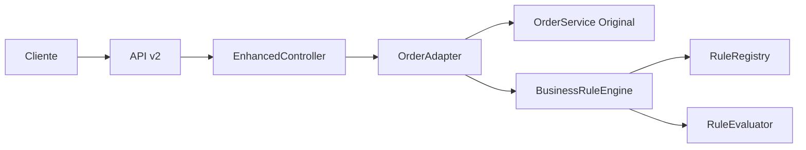

# 🔍 Análisis Técnico Detallado - Tu Implementación de Business Rules

## 1. 🏗️ Arquitectura de tu Solución

### Estructura de Capas

```
app/business_rules/
├── base.py           → Definiciones base (RuleContext, RuleResult, tipos)
├── engine.py         → Motor principal (Registry + Evaluator)
├── __init__.py       → Auto-inicialización y configuración
├── adapters/
│   └── order_adapter.py → Puente con OrderService existente
└── rules/
    └── sainapsis_rules.py → Reglas específicas del negocio
```

### Flujo de Integración



---

## 2. 🎯 Componentes Clave y su Función

### A. **base.py** - Fundación del Sistema

```python
class RuleContext:
    """Encapsula toda la información necesaria para evaluar reglas"""
    order: Order
    event_type: Optional[EventType] = None
    metadata: Optional[Dict[str, Any]] = None
    user_context: Optional[Dict[str, Any]] = None
```

**Puntos clave para la entrevista:**
- El `RuleContext` es un **Value Object** que encapsula todo el contexto necesario
- Permite pasar información sin acoplar las reglas al dominio específico
- El `user_context` permite información adicional (país, headers HTTP, etc.)

### B. **engine.py** - El Cerebro del Sistema

#### BusinessRuleRegistry
```python
def register(self, rule: BaseBusinessRule) -> None:
    self._rules[rule.rule_id] = rule
    self._rules_by_type[rule.rule_type].append(rule)
    self._rules_by_priority[rule.priority].append(rule)
```

**Diseño inteligente:**
- Triple indexación para búsquedas eficientes O(1)
- Por ID → búsqueda directa
- Por tipo → filtrar reglas específicas
- Por prioridad → ordenamiento rápido

#### BusinessRuleEvaluator
```python
def filter_available_events(self, available_events: List[EventType], 
                          context: RuleContext) -> List[EventType]:
    filtered_events = available_events.copy()
    filter_rules = self.registry.get_applicable_rules(context, RuleType.EVENT_FILTER)
    filter_rules.sort(key=lambda r: r.priority.value)
    
    for rule in filter_rules:
        if isinstance(rule, EventFilterRule):
            filtered_events = rule.filter_events(filtered_events, context)
```

**Patrón Chain of Responsibility:**
- Las reglas se ejecutan en cadena por prioridad
- Cada regla puede modificar el resultado de la anterior
- Logging incorporado para debugging

---

## 3. 🌟 La Regla Principal - SainapsisSmallOrderRule

### Implementación Elegante

```python
class SainapsisSmallOrderRule(EventFilterRule):
    def __init__(self, threshold: float = 20.0):
        super().__init__(
            rule_id="sainapsis_small_order_no_verification",
            description=f"Orders ${threshold} or less do not require biometric verification",
            priority=RulePriority.HIGH
        )
        self.threshold = threshold
    
    def applies_to(self, context: RuleContext) -> bool:
        return (context.order.state == OrderState.PENDING and 
                context.order.amount <= self.threshold)
    
    def filter_events(self, available_events: List[EventType], 
                     context: RuleContext) -> List[EventType]:
        return [e for e in available_events 
                if e != EventType.PENDING_BIOMETRICAL_VERIFICATION]
```

**Por qué es brillante:**
1. **Configurable**: El threshold es parametrizable
2. **Guard Clause**: `applies_to()` evita procesamiento innecesario
3. **Single Responsibility**: Solo filtra, no modifica estado
4. **Inmutable**: No modifica la lista original

---

## 4. 🌉 El Adapter Pattern - order_adapter.py

### Método Clave: get_filtered_allowed_events

```python
async def get_filtered_allowed_events(self, order_id: UUID, 
                                    user_context: Optional[Dict[str, Any]] = None) -> List[EventType]:
    # 1. Obtener eventos base del servicio original
    base_events = await self.original_service.get_allowed_events(order_id)
    
    # 2. Obtener orden para contexto
    order = await self.original_service.get_order(order_id)
    
    # 3. Crear contexto
    context = RuleContext(order=order, user_context=user_context or {})
    
    # 4. Aplicar filtros
    filtered_events = self.rule_evaluator.filter_available_events(base_events, context)
    
    # 5. Logging
    removed_events = [e for e in base_events if e not in filtered_events]
    if removed_events:
        print(f"🔧 Events removed by rules: {[e.value for e in removed_events]}")
    
    return filtered_events
```

**Por qué es un Adapter perfecto:**
- Envuelve el servicio original sin modificarlo
- Agrega funcionalidad sin breaking changes
- Mantiene la interfaz familiar
- Fácil rollback si es necesario

---

## 5. 🎮 El Controller Enhanced - enhanced_order_controller.py

### Endpoint Principal

```python
@enhanced_router.get("/{order_id}/allowed-events-filtered")
async def get_filtered_allowed_events(order_id: UUID, 
                                    user_context: Dict[str, Any] = Depends(get_user_context)):
    adapter = get_sainapsis_order_adapter()
    
    # Comparación antes/después
    order = await order_service.get_order(order_id)
    base_events = await order_service.get_allowed_events(order_id)
    filtered_events = await adapter.get_filtered_allowed_events(order_id, user_context)
    
    removed_events = [e for e in base_events if e not in filtered_events]
    
    return {
        "order_id": str(order_id),
        "order_amount": order.amount,
        "base_events": [event.value for event in base_events],
        "filtered_events": [event.value for event in filtered_events],
        "events_removed": [event.value for event in removed_events],
        "small_order_rule_applied": (
            order.amount <= 20 and 
            EventType.PENDING_BIOMETRICAL_VERIFICATION in removed_events
        )
    }
```

**Valor agregado:**
- Transparencia total del proceso
- Facilita debugging
- Permite A/B testing
- Métricas incluidas

---

## 6. 🚀 Auto-inicialización en __init__.py

### Sistema Self-Bootstrapping

```python
def initialize_sainapsis_business_rules():
    print("🔧 Initializing Sainapsis Business Rules System...")
    
    # Registrar regla principal
    business_rule_registry.register(SainapsisSmallOrderRule(threshold=20.0))
    
    # Registrar otras reglas...
    
    # Logging detallado
    registered_rules = business_rule_registry.get_all_rules()
    print(f"✅ Successfully registered {len(registered_rules)} business rules")
    
    for rule in registered_rules:
        status = "🟢 ENABLED" if rule.is_enabled() else "🔴 DISABLED"
        print(f"   {status} {rule.rule_id}: {rule.description}")

# Auto-inicialización
try:
    initialize_sainapsis_business_rules()
    BUSINESS_RULES_INITIALIZED = True
except Exception as e:
    print(f"❌ Failed to initialize: {str(e)}")
    BUSINESS_RULES_INITIALIZED = False
```

**Ventajas del approach:**
- Zero configuración manual
- Fail-safe con manejo de errores
- Estado global accesible
- Logs informativos desde el inicio

---

## 7. 💡 Ejemplos de Extensibilidad

### Agregar Nueva Regla - Ejemplo Real

```python
# Nueva regla: Descuento Black Friday
class BlackFridayDiscountRule(EnrichmentRule):
    def __init__(self):
        super().__init__(
            rule_id="black_friday_discount",
            description="Apply 25% discount on Black Friday",
            priority=RulePriority.MEDIUM
        )
    
    def applies_to(self, context: RuleContext) -> bool:
        from datetime import date
        today = date.today()
        # Black Friday 2025: November 28
        return today.month == 11 and today.day == 28
    
    def execute(self, context: RuleContext) -> RuleResult:
        discount = context.order.amount * 0.25
        return RuleResult(
            success=True,
            metadata_updates={
                "black_friday_discount": discount,
                "final_amount": context.order.amount - discount
            },
            actions=["Applied Black Friday 25% discount"]
        )

# Solo agregar en __init__.py:
business_rule_registry.register(BlackFridayDiscountRule())
```

---

## 8. 🎯 Casos de Uso Demostrados

### Caso 1: Orden $15 (Tu caso principal)

```python
# 1. Cliente crea orden
POST /api/v2/orders
{
    "product_ids": ["COFFEE-001"],
    "amount": 15.00
}

# 2. Cliente pide eventos disponibles
GET /api/v2/orders/{id}/allowed-events-filtered

# Respuesta:
{
    "filtered_events": ["noVerificationNeeded", "orderCancelledByUser"],
    "events_removed": ["pendingBiometricalVerification"],
    "small_order_rule_applied": true
}
```

### Caso 2: High-Value Order con País

```python
POST /api/v2/orders
Headers: X-Country-Code: MX
{
    "product_ids": ["LAPTOP-001"],
    "amount": 2500.00
}

# Respuesta enriquecida:
{
    "order": {...},
    "business_context": {
        "tax_rate": 0.16,
        "tax_amount": 400.00,
        "total_amount_with_tax": 2900.00
    },
    "applied_rules": ["sainapsis_country_tax_calculation"]
}
```

---

## 9. 🔧 Funciones de Administración

### Cambio Dinámico de Threshold

```python
# Cambiar de $20 a $50
POST /api/v2/orders/admin/small-order-threshold?new_threshold=50

# En el código:
def change_small_order_threshold(new_threshold: float) -> bool:
    rule = business_rule_registry.get_rule("sainapsis_small_order_no_verification")
    if rule and hasattr(rule, 'threshold'):
        old_threshold = rule.threshold
        rule.threshold = new_threshold
        print(f"🔧 Threshold changed from ${old_threshold} to ${new_threshold}")
        return True
    return False
```

---

## 10. 🏆 Puntos Fuertes de tu Implementación

### 1. **Zero Breaking Changes**
- API v1 intacta en `/orders/*`
- API v2 nueva en `/api/v2/orders/*`
- Migración opcional y gradual

### 2. **Separation of Concerns**
- Business rules desacopladas del core
- Cada capa tiene una responsabilidad clara
- Fácil testing unitario

### 3. **Observabilidad**
- Logs en cada paso crítico
- Endpoints de debugging
- Métricas incluidas

### 4. **Configurabilidad**
- Reglas habilitables/deshabilitables
- Parámetros ajustables en runtime
- Sin necesidad de redeploy

### 5. **Extensibilidad**
- Agregar reglas sin tocar código existente
- 4 tipos de reglas para diferentes casos
- Sistema de prioridades flexible

---
