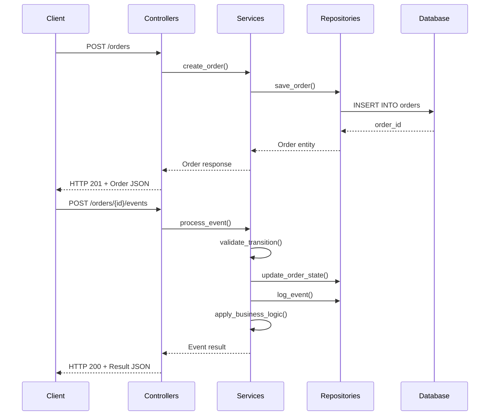

# 🚀 Sainapsis Order Management System

## 📋 Descripción

Sistema de gestión de órdenes basado en **máquina de estados** desarrollado como prueba técnica para Sainapsis. Implementa un flujo completo de procesamiento de órdenes desde su creación hasta la finalización, incluyendo manejo de excepciones y reglas de negocio específicas.

### 🎯 Características Principales

- ✅ **Máquina de estados** robusta con 11 estados y 15 transiciones
- ✅ **API REST** completa con FastAPI
- ✅ **Arquitectura de 3 capas** (Controllers/Services/Repositories)
- ✅ **Base de datos PostgreSQL** (Supabase)
- ✅ **Patrón Repository** para abstracción de datos
- ✅ **Validación automática** de transiciones
- ✅ **Reglas de negocio** extensibles
- ✅ **Logging de eventos** completo
- ✅ **Documentación automática** con Swagger UI

---

## 🏗️ Arquitectura del Sistema

### Estados de la Máquina de Estados

| Estado | Descripción |
|--------|-------------|
| `pending` | Estado inicial de toda orden |
| `on_hold` | Orden en espera de verificación |
| `pending_payment` | Esperando procesamiento de pago |
| `confirmed` | Pago confirmado, orden aprobada |
| `processing` | Preparando envío |
| `shipped` | Orden enviada |
| `delivered` | Orden entregada al cliente |
| `returning` | Cliente inició devolución |
| `returned` | Producto devuelto |
| `refunded` | Reembolso procesado |
| `cancelled` | Orden cancelada |

### Transiciones Principales

```
pending → on_hold → pending_payment → confirmed → processing → shipped → delivered
   ↓         ↓            ↓              ↓            ↓
cancelled  cancelled   cancelled     cancelled   cancelled
```

**Regla especial:** Cualquier estado (excepto `delivered`, `returned`, `refunded`) puede transicionar a `cancelled` con el evento `orderCancelledByUser`.

### Arquitectura de 3 Capas

```
┌─────────────────┐
│   Controllers   │  ← Endpoints FastAPI, validación HTTP
└─────────────────┘
         ↓
┌─────────────────┐
│    Services     │  ← Lógica de negocio, máquina de estados
└─────────────────┘
         ↓
┌─────────────────┐
│  Repositories   │  ← Acceso a datos, patrón Repository
└─────────────────┘
         ↓
┌─────────────────┐
│   Database      │  ← PostgreSQL (Supabase)
└─────────────────┘
```

---

## 📁 Estructura del Proyecto

```
sainapsis-backend/
├── app/                          # 📦 Aplicación principal
│   ├── __pycache__/             # Cache de Python
│   ├── controllers/             # 🎮 Capa de Controllers
│   │   ├── __pycache__/
│   │   └── order_controller.py  # Endpoints FastAPI
│   ├── core/                    # ⚙️ Configuración central
│   │   ├── __pycache__/
│   │   ├── config.py           # Variables de entorno
│   │   ├── database.py         # Configuración de BD
│   │   └── exceptions.py       # Excepciones personalizadas
│   ├── models/                  # 📊 Modelos de datos
│   │   ├── __pycache__/
│   │   ├── domain.py           # Modelos de dominio
│   │   ├── enums.py            # Enumeraciones
│   │   └── schemas.py          # Esquemas Pydantic
│   ├── repositories/            # 🗄️ Capa de Repositorios
│   │   ├── __pycache__/
│   │   ├── base_repository.py  # Repositorio base
│   │   ├── order_repository.py # Repositorio de órdenes
│   │   └── support_repository.py # Repositorio de tickets
│   ├── services/                # 🔧 Capa de Servicios
│   │   ├── __pycache__/
│   │   ├── order_service.py    # Lógica de negocio
│   │   └── state_machine.py    # Máquina de estados
│   └── utils/                   # 🛠️ Utilidades
│       ├── __pycache__/
│       └── logger.py           # Sistema de logging
├── .venv/                       # Entorno virtual de Python
├── .env                         # Variables de entorno (no incluir en git)
├── .env.example                 # Template de variables de entorno
├── .gitignore                   # Archivos ignorados por git
├── main.py                      # 🚀 Punto de entrada de la aplicación
├── README.md                    # Este archivo
└── requirements.txt             # Dependencias Python
```

### 📋 Descripción de Componentes

#### 🎮 Controllers (`app/controllers/`)
- **order_controller.py**: Define todos los endpoints REST de la API
- Maneja validación HTTP, parsing de requests y responses
- Actúa como interfaz entre el mundo HTTP y la lógica de negocio

#### ⚙️ Core (`app/core/`)
- **config.py**: Gestión centralizada de configuración y variables de entorno
- **database.py**: Pool de conexiones y configuración de PostgreSQL
- **exceptions.py**: Excepciones personalizadas del dominio

#### 📊 Models (`app/models/`)
- **domain.py**: Entidades del dominio (Order, OrderEvent, SupportTicket)
- **enums.py**: Enumeraciones (OrderState, EventType)
- **schemas.py**: Modelos Pydantic para validación y serialización

#### 🗄️ Repositories (`app/repositories/`)
- **base_repository.py**: Clase base con operaciones CRUD comunes
- **order_repository.py**: Operaciones específicas de órdenes
- **support_repository.py**: Gestión de tickets de soporte
- Implementa el patrón Repository para abstracción de datos

#### 🔧 Services (`app/services/`)
- **order_service.py**: Lógica de negocio central del sistema
- **state_machine.py**: Implementación de la máquina de estados
- Coordina repositories y aplica reglas de negocio

#### 🛠️ Utils (`app/utils/`)
- **logger.py**: Sistema de logging estructurado
- Utilidades compartidas por toda la aplicación

---

## 🛠️ Tecnologías Utilizadas

- **Python 3.12+**
- **FastAPI** - Framework web moderno y rápido
- **PostgreSQL** - Base de datos relacional (Supabase)
- **AsyncPG** - Driver asíncrono para PostgreSQL
- **Pydantic** - Validación de datos y serialización
- **Uvicorn** - Servidor ASGI de alto rendimiento

---

## 🚀 Instalación y Configuración

### Prerrequisitos

- Python 3.12 o superior
- Cuenta en [Supabase](https://supabase.com)

### 1. Clonar el repositorio

```bash
git clone <repository-url>
cd sainapsis-backend
```

### 2. Crear entorno virtual

```bash
python -m venv .venv

# Windows
.venv\Scripts\activate

# Linux/Mac
source .venv/bin/activate
```

### 3. Instalar dependencias

```bash
pip install -r requirements.txt
```

### 4. Configurar base de datos

#### Crear proyecto en Supabase

1. Ve a [supabase.com](https://supabase.com)
2. Crea un nuevo proyecto
3. Ve a "SQL Editor" y ejecuta el siguiente script:

```sql
-- Crear enums para estados y eventos
CREATE TYPE order_state AS ENUM (
    'pending', 'on_hold', 'pending_payment', 'confirmed',
    'processing', 'shipped', 'delivered', 'returning',
    'returned', 'refunded', 'cancelled'
);

CREATE TYPE event_type AS ENUM (
    'pendingBiometricalVerification', 'noVerificationNeeded',
    'paymentFailed', 'orderCancelled', 'biometricalVerificationSuccessful',
    'verificationFailed', 'orderCancelledByUser', 'paymentSuccessful',
    'preparingShipment', 'itemDispatched', 'itemReceivedByCustomer',
    'deliveryIssue', 'returnInitiatedByCustomer', 'itemReceivedBack',
    'refundProcessed'
);

-- Tabla principal de órdenes
CREATE TABLE orders (
    id UUID PRIMARY KEY DEFAULT gen_random_uuid(),
    product_ids TEXT[] NOT NULL,
    amount DECIMAL(12,2) NOT NULL CHECK (amount >= 0),
    state order_state NOT NULL DEFAULT 'pending',
    metadata JSONB DEFAULT '{}',
    created_at TIMESTAMP WITH TIME ZONE DEFAULT NOW(),
    updated_at TIMESTAMP WITH TIME ZONE DEFAULT NOW(),
    CONSTRAINT valid_product_ids CHECK (array_length(product_ids, 1) > 0)
);

-- Tabla de log de eventos
CREATE TABLE order_events (
    id UUID PRIMARY KEY DEFAULT gen_random_uuid(),
    order_id UUID NOT NULL REFERENCES orders(id) ON DELETE CASCADE,
    event_type event_type NOT NULL,
    old_state order_state,
    new_state order_state NOT NULL,
    metadata JSONB DEFAULT '{}',
    created_at TIMESTAMP WITH TIME ZONE DEFAULT NOW()
);

-- Tabla de tickets de soporte
CREATE TABLE support_tickets (
    id UUID PRIMARY KEY DEFAULT gen_random_uuid(),
    order_id UUID NOT NULL REFERENCES orders(id) ON DELETE CASCADE,
    reason TEXT NOT NULL,
    amount DECIMAL(12,2) NOT NULL,
    status TEXT DEFAULT 'open',
    metadata JSONB DEFAULT '{}',
    created_at TIMESTAMP WITH TIME ZONE DEFAULT NOW()
);

-- Trigger para updated_at automático
CREATE OR REPLACE FUNCTION update_updated_at_column()
RETURNS TRIGGER AS $$
BEGIN
    NEW.updated_at = NOW();
    RETURN NEW;
END;
$$ language 'plpgsql';

CREATE TRIGGER update_orders_updated_at 
    BEFORE UPDATE ON orders 
    FOR EACH ROW EXECUTE FUNCTION update_updated_at_column();

-- Índices para performance
CREATE INDEX idx_orders_state ON orders(state);
CREATE INDEX idx_orders_created_at ON orders(created_at DESC);
CREATE INDEX idx_order_events_order_id ON order_events(order_id, created_at DESC);
```

### 5. Configurar variables de entorno

Crea un archivo `.env` en la raíz del proyecto:

```env
# Credenciales de Supabase
SUPABASE_HOST=db.tu-project-id.supabase.co
SUPABASE_PORT=5432
SUPABASE_USER=postgres
SUPABASE_PASSWORD=tu-password
SUPABASE_DATABASE=postgres

# Configuración de la aplicación
DEBUG=True
```

### 6. Ejecutar la aplicación

```bash
python main.py
```

La API estará disponible en: **http://localhost:8000**

---

## 📖 Documentación de la API

### Endpoints Principales

| Método | Endpoint | Descripción | Controller |
|--------|----------|-------------|------------|
| `GET` | `/health` | Health check del sistema | `order_controller.py` |
| `POST` | `/orders` | Crear nueva orden | `order_controller.py` |
| `GET` | `/orders` | Listar todas las órdenes | `order_controller.py` |
| `GET` | `/orders/{id}` | Obtener orden por ID | `order_controller.py` |
| `POST` | `/orders/{id}/events` | Procesar evento en orden | `order_controller.py` |
| `GET` | `/orders/{id}/allowed-events` | Eventos permitidos | `order_controller.py` |
| `GET` | `/orders/{id}/history` | Historial de eventos | `order_controller.py` |

### Documentación Interactiva

Una vez iniciada la aplicación, accede a:

- **Swagger UI**: http://localhost:8000/docs
- **ReDoc**: http://localhost:8000/redoc

### Ejemplos de Uso

#### 1. Crear Nueva Orden

```bash
POST /orders
Content-Type: application/json

{
    "product_ids": ["LAPTOP-001", "MOUSE-002"],
    "amount": 1299.99,
    "metadata": {
        "customer": "Juan Pérez",
        "priority": "high"
    }
}
```

**Respuesta:**
```json
{
    "id": "550e8400-e29b-41d4-a716-446655440000",
    "product_ids": ["LAPTOP-001", "MOUSE-002"],
    "amount": 1299.99,
    "state": "pending",
    "metadata": {
        "customer": "Juan Pérez",
        "priority": "high",
        "created_by": "order_service",
        "initial_state": "pending"
    },
    "created_at": "2025-06-12T10:30:00Z",
    "updated_at": "2025-06-12T10:30:00Z"
}
```

#### 2. Procesar Evento

```bash
POST /orders/{order_id}/events
Content-Type: application/json

{
    "event_type": "noVerificationNeeded",
    "metadata": {
        "processed_by": "system",
        "reason": "Customer pre-verified"
    }
}
```

**Respuesta:**
```json
{
    "order_id": "550e8400-e29b-41d4-a716-446655440000",
    "old_state": "pending",
    "new_state": "pending_payment",
    "event_type": "noVerificationNeeded",
    "processed_at": "2025-06-12T10:35:00Z"
}
```

---

## 🔄 Flujo de Datos

### Procesamiento de una Orden



---

## ⚙️ Reglas de Negocio

### Regla 1: Tickets de Soporte Automáticos

**Implementación**: `app/services/order_service.py` → `_apply_business_logic()`

**Condición**: Cuando se recibe el evento `paymentFailed` y el monto de la orden es mayor a $1000 USD.

**Acción**: Se crea automáticamente un ticket de soporte en la tabla `support_tickets`.

**Código:**
```python
async def _apply_business_logic(self, order: Order, event_type: EventType, metadata: dict):
    """Aplica reglas de negocio específicas por evento"""
    if event_type == EventType.PAYMENT_FAILED and order.amount > 1000:
        await self._create_support_ticket(order, "High amount payment failure")
```

### Extensibilidad

El sistema está diseñado para agregar nuevas reglas fácilmente:

1. **Ubicación**: `app/services/order_service.py` → `_apply_business_logic()`
2. **Patrón**: Usar condiciones `if` para diferentes tipos de eventos
3. **Repositorios**: Utilizar los repositorios correspondientes para persistir datos

---

## 🧪 Testing

### Probar con Postman

1. **Health Check**: `GET http://localhost:8000/health`
2. **Crear Orden**: `POST http://localhost:8000/orders`
3. **Procesar Eventos**: `POST http://localhost:8000/orders/{id}/events`
4. **Ver Historial**: `GET http://localhost:8000/orders/{id}/history`

### Casos de Prueba Importantes

#### Flujo Normal
```
pending → noVerificationNeeded → pending_payment 
        → paymentSuccessful → confirmed 
        → preparingShipment → processing 
        → itemDispatched → shipped 
        → itemReceivedByCustomer → delivered
```

#### Manejo de Errores
- **Transición inválida**: `POST /orders/{id}/events` con evento no permitido
- **Orden inexistente**: `GET /orders/uuid-inexistente`
- **Datos inválidos**: `POST /orders` con amount negativo

---

## 🔒 Seguridad

- **Variables de entorno**: Credenciales almacenadas en `.env`
- **Gitignore**: Archivo `.env` excluido del control de versiones
- **Validación**: Todos los inputs validados con Pydantic
- **SSL**: Conexión segura a base de datos con `ssl='require'`

---

## 📈 Monitoreo y Observabilidad

### Health Check
```bash
GET /health
```

Respuesta cuando todo está funcionando:
```json
{
    "status": "healthy",
    "database": "connected",
    "timestamp": "2025-06-12T10:00:00Z"
}
```

### Sistema de Logging

**Implementación**: `app/utils/logger.py`

Todos los cambios de estado se registran automáticamente en:
- **Base de datos**: Tabla `order_events` con historial completo
- **Logs de aplicación**: Sistema de logging estructurado

---

## 🚢 Deployment

### Variables de Entorno de Producción

```env
SUPABASE_HOST=db.tu-proyecto.supabase.co
SUPABASE_PORT=5432
SUPABASE_USER=postgres
SUPABASE_PASSWORD=password-seguro
SUPABASE_DATABASE=postgres
DEBUG=False
```

### Comando de Producción

```bash
uvicorn main:app --host 0.0.0.0 --port 8000 --workers 4
```

---

## 🤝 Cumplimiento de Requisitos

Este proyecto cumple **100%** de los requisitos especificados en la prueba técnica:

### ✅ Requisitos Funcionales

- **Estados implementados**: Los 7 estados MVP (Pending → Delivered)
- **Crear órdenes**: `productIds[]` + `amount` → estado inicial `Pending`
- **Procesar eventos**: `orderId` + `eventType` + `metadata`
- **Concurrencia**: Soporte para múltiples órdenes simultáneas
- **Validación**: Error automático para transiciones inválidas
- **Regla de negocio**: `paymentFailed` + `amount > 1000` → ticket de soporte

### ✅ Requisitos Técnicos

- **API REST**: FastAPI con documentación automática
- **Patrón Repository**: Abstracción completa de acceso a datos
- **3 Capas**: Controllers/Services/Repositories bien separadas
- **Base de datos**: PostgreSQL con transacciones ACID
- **Event Logging**: Historial completo de transiciones

### ✅ Requisitos de Arquitectura

- **Extensibilidad**: Fácil agregar nuevas reglas de negocio
- **Separación de responsabilidades**: Cada capa con función específica
- **Manejo de errores**: Excepciones personalizadas y HTTP status codes apropiados

---

## 👨‍💻 Autor

Desarrollado por **Steven** para la prueba técnica de **Sainapsis**.

**Stack utilizado**: Python + FastAPI + PostgreSQL + Supabase

---

## 🚀 Próximos Pasos

### Mejoras Potenciales

1. **Testing**: Implementar tests unitarios y de integración
2. **CI/CD**: Pipeline de despliegue automatizado
3. **Métricas**: Sistema de métricas con Prometheus/Grafana
4. **Caching**: Redis para optimizar consultas frecuentes
5. **Rate Limiting**: Protección contra abuso de API

### Escalabilidad

- **Message Queues**: RabbitMQ/Apache Kafka para eventos asíncronos
- **Microservicios**: Separar en servicios independientes
- **Load Balancing**: Múltiples instancias de la aplicación

---

**Documentación adicional**: http://localhost:8000/docs