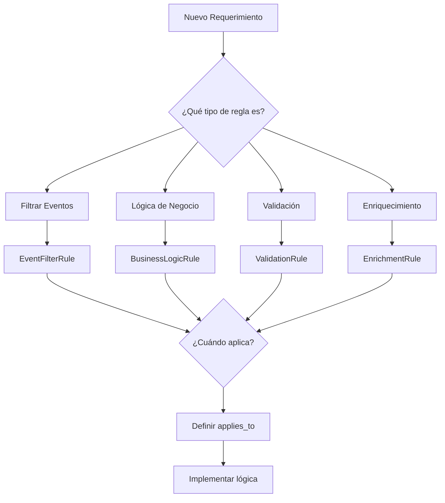

# 🚀 Guía Completa: Cómo Agregar Nuevas Reglas al Sistema

## 📋 Proceso de Decisión para Nueva Regla

### 1. Análisis del Requerimiento

**Preguntas clave que haría:**



---

## 🎯 Casos Reales de Nuevas Reglas

### Caso 1: "Restricción de Horario Bancario"
**Requerimiento**: "Órdenes > $500 solo pueden procesarse en horario bancario (9AM-5PM)"

#### Paso 1: Analizar el tipo
- ¿Filtra eventos? ✅ SÍ - Limita qué puede hacer el usuario
- Tipo: `EventFilterRule`

#### Paso 2: Implementar

```python
# app/business_rules/rules/sainapsis_rules.py

class BankingHoursRestrictionRule(EventFilterRule):
    """Restricts high-value orders to banking hours"""
    
    def __init__(self, amount_threshold: float = 500.0, 
                 start_hour: int = 9, end_hour: int = 17):
        super().__init__(
            rule_id="banking_hours_restriction",
            description=f"Orders >${amount_threshold} only during {start_hour}-{end_hour}h",
            priority=RulePriority.HIGH
        )
        self.amount_threshold = amount_threshold
        self.start_hour = start_hour
        self.end_hour = end_hour
    
    def applies_to(self, context: RuleContext) -> bool:
        # Solo aplica a órdenes grandes en estado PENDING
        return (context.order.amount > self.amount_threshold and 
                context.order.state == OrderState.PENDING)
    
    def filter_events(self, available_events: List[EventType], 
                     context: RuleContext) -> List[EventType]:
        from datetime import datetime, timezone
        
        # Obtener hora actual (considerar timezone del usuario si está disponible)
        user_timezone = context.user_context.get('timezone', 'UTC')
        current_hour = datetime.now(timezone.utc).hour
        
        # Si estamos fuera de horario bancario
        if current_hour < self.start_hour or current_hour >= self.end_hour:
            # Solo permitir cancelación
            return [EventType.ORDER_CANCELLED_BY_USER]
        
        # En horario bancario, permitir todo
        return available_events
```

#### Paso 3: Registrar

```python
# app/business_rules/__init__.py

def initialize_sainapsis_business_rules():
    # ... existing rules ...
    
    # Nueva regla de horario bancario
    business_rule_registry.register(
        BankingHoursRestrictionRule(
            amount_threshold=500.0,
            start_hour=9,
            end_hour=17
        )
    )
```

#### Paso 4: Testing

```python
# tests/test_banking_hours_rule.py

def test_banking_hours_restriction():
    # Crear orden de $600
    order = Order(amount=600, state=OrderState.PENDING)
    context = RuleContext(order=order)
    
    rule = BankingHoursRestrictionRule()
    
    # Mock hora fuera de horario
    with mock.patch('datetime.datetime.now') as mock_now:
        mock_now.return_value.hour = 20  # 8 PM
        
        events = [EventType.NO_VERIFICATION_NEEDED, 
                 EventType.PENDING_BIOMETRICAL_VERIFICATION,
                 EventType.ORDER_CANCELLED_BY_USER]
        
        filtered = rule.filter_events(events, context)
        
        assert filtered == [EventType.ORDER_CANCELLED_BY_USER]
```

---

### Caso 2: "Programa de Lealtad - Descuento por Compras Frecuentes"
**Requerimiento**: "Usuarios con 5+ órdenes en el último mes obtienen 10% descuento"

#### Paso 1: Analizar
- ¿Enriquece datos? ✅ SÍ - Agrega descuento
- ¿Necesita datos externos? ✅ SÍ - Historial de órdenes
- Tipo: `EnrichmentRule`

#### Paso 2: Implementar

```python
class LoyaltyDiscountRule(EnrichmentRule):
    """Apply discount for frequent customers"""
    
    def __init__(self, orders_threshold: int = 5, 
                 discount_percentage: float = 0.10):
        super().__init__(
            rule_id="loyalty_discount",
            description=f"{int(discount_percentage*100)}% off for {orders_threshold}+ orders/month",
            priority=RulePriority.MEDIUM
        )
        self.orders_threshold = orders_threshold
        self.discount_percentage = discount_percentage
    
    def applies_to(self, context: RuleContext) -> bool:
        # Aplica a órdenes nuevas (PENDING)
        return context.order.state == OrderState.PENDING
    
    async def execute(self, context: RuleContext) -> RuleResult:
        # Necesitamos acceso al repositorio
        from app.repositories.order_repository import order_repository
        
        # Obtener user_id del contexto
        user_id = context.user_context.get('user_id')
        if not user_id:
            return RuleResult(success=True)  # No hay usuario, no hay descuento
        
        # Contar órdenes del último mes
        from datetime import datetime, timedelta
        one_month_ago = datetime.utcnow() - timedelta(days=30)
        
        # Aquí necesitarías agregar un método al repositorio
        order_count = await order_repository.count_user_orders_since(
            user_id, one_month_ago
        )
        
        if order_count >= self.orders_threshold:
            discount = context.order.amount * self.discount_percentage
            
            return RuleResult(
                success=True,
                metadata_updates={
                    'loyalty_discount': round(discount, 2),
                    'loyalty_discount_percentage': self.discount_percentage,
                    'customer_order_count': order_count,
                    'final_amount': round(context.order.amount - discount, 2)
                },
                actions=[f"Applied {int(self.discount_percentage*100)}% loyalty discount"]
            )
        
        return RuleResult(success=True)
```

---

### Caso 3: "Detección de Fraude - Velocity Check"
**Requerimiento**: "Bloquear si hay 3+ órdenes en 5 minutos"

#### Paso 1: Analizar
- ¿Valida la operación? ✅ SÍ
- ¿Puede bloquear? ✅ SÍ
- Tipo: `ValidationRule` con `CRITICAL` priority

#### Paso 2: Implementar

```python
class VelocityCheckRule(ValidationRule):
    """Prevent rapid-fire orders (potential fraud)"""
    
    def __init__(self, max_orders: int = 3, time_window_minutes: int = 5):
        super().__init__(
            rule_id="velocity_check",
            description=f"Max {max_orders} orders in {time_window_minutes} minutes",
            priority=RulePriority.CRITICAL  # CRITICAL para bloquear
        )
        self.max_orders = max_orders
        self.time_window_minutes = time_window_minutes
    
    def applies_to(self, context: RuleContext) -> bool:
        # Aplica a creación de órdenes nuevas
        return context.order.state == OrderState.PENDING
    
    async def execute(self, context: RuleContext) -> RuleResult:
        from app.repositories.order_repository import order_repository
        from datetime import datetime, timedelta
        
        user_id = context.user_context.get('user_id')
        if not user_id:
            return RuleResult(success=True)  # Sin user_id, no podemos validar
        
        # Buscar órdenes recientes
        time_threshold = datetime.utcnow() - timedelta(minutes=self.time_window_minutes)
        
        recent_orders = await order_repository.get_user_orders_since(
            user_id, time_threshold
        )
        
        if len(recent_orders) >= self.max_orders:
            return RuleResult(
                success=False,
                error_message=f"Too many orders. Please wait before placing another order.",
                metadata_updates={
                    'velocity_check_failed': True,
                    'recent_order_count': len(recent_orders),
                    'blocked_until': (datetime.utcnow() + timedelta(minutes=5)).isoformat()
                }
            )
        
        return RuleResult(
            success=True,
            metadata_updates={
                'velocity_check_passed': True,
                'recent_order_count': len(recent_orders)
            }
        )
```

---

### Caso 4: "Notificación por Monto Alto"
**Requerimiento**: "Enviar SMS al manager para órdenes > $10,000"

#### Paso 1: Analizar
- ¿Ejecuta lógica de negocio? ✅ SÍ
- ¿Side effects? ✅ SÍ - Envía SMS
- Tipo: `BusinessLogicRule`

#### Paso 2: Implementar

```python
class HighValueNotificationRule(BusinessLogicRule):
    """Notify management of high-value orders"""
    
    def __init__(self, threshold: float = 10000.0):
        super().__init__(
            rule_id="high_value_notification",
            description=f"SMS notification for orders >${threshold}",
            priority=RulePriority.LOW  # No es crítico
        )
        self.threshold = threshold
    
    def applies_to(self, context: RuleContext) -> bool:
        return (context.event_type == EventType.PAYMENT_SUCCESSFUL and
                context.order.amount > self.threshold)
    
    async def execute(self, context: RuleContext) -> RuleResult:
        # Aquí integrarías con tu servicio de SMS
        notification_data = {
            "type": "sms",
            "recipient": "+1234567890",  # Manager phone
            "message": f"High value order ${context.order.amount} - Order ID: {context.order.id}",
            "priority": "high"
        }
        
        # En un sistema real, enviarías a una cola
        # await notification_service.send_sms(notification_data)
        
        return RuleResult(
            success=True,
            actions=[f"SMS notification queued for ${context.order.amount} order"],
            metadata_updates={
                'high_value_notification_sent': True,
                'notification_timestamp': datetime.utcnow().isoformat()
            }
        )
```

---

## 🏗️ Proceso Completo de Agregar una Regla

### 1. **Crear la Regla** (sainapsis_rules.py)
```python
class MyNewRule(AppropriateBaseClass):
    def __init__(self):
        super().__init__(...)
    
    def applies_to(self, context):
        # Definir cuándo aplica
    
    def execute/filter_events(self, ...):
        # Implementar lógica
```

### 2. **Registrarla** (__init__.py)
```python
business_rule_registry.register(MyNewRule())
```

### 3. **Testearla** (tests/)
```python
def test_my_new_rule():
    # Test applies_to
    # Test lógica principal
    # Test edge cases
```

### 4. **Documentarla**
```python
"""
Rule: My New Rule
Type: EventFilter/BusinessLogic/Validation/Enrichment
Purpose: [Business reason]
Applies when: [Conditions]
Effect: [What it does]
Priority: HIGH/MEDIUM/LOW
"""
```

### 5. **Agregar Endpoint de Test** (opcional)
```python
@enhanced_router.get("/test/my-new-rule")
async def test_my_new_rule_endpoint():
    # Endpoint para QA/Business validation
```

---

## 🎨 Patrones de Diseño para Nuevas Reglas

### 1. **Reglas Compuestas**
```python
class CompositeRule(EventFilterRule):
    def __init__(self, rules: List[EventFilterRule]):
        self.rules = rules
    
    def applies_to(self, context):
        return any(rule.applies_to(context) for rule in self.rules)
    
    def filter_events(self, events, context):
        for rule in self.rules:
            if rule.applies_to(context):
                events = rule.filter_events(events, context)
        return events
```

### 2. **Reglas con Estado/Cache**
```python
class CachedRule(BusinessLogicRule):
    def __init__(self):
        self._cache = {}
        self._cache_ttl = 300  # 5 minutes
    
    def execute(self, context):
        cache_key = f"{context.order.id}:{context.event_type}"
        
        if cache_key in self._cache:
            # Return cached result
            return self._cache[cache_key]
        
        result = self._execute_logic(context)
        self._cache[cache_key] = result
        return result
```

### 3. **Reglas con Configuración Externa**
```python
class ConfigurableRule(EnrichmentRule):
    def __init__(self):
        self.config = self._load_config()
    
    def _load_config(self):
        # Cargar de BD, API, archivo, etc.
        return {
            "discounts": {"US": 0.05, "CA": 0.07},
            "thresholds": {"min": 10, "max": 10000}
        }
```

---

## 📊 Decisiones de Diseño al Agregar Reglas

### 1. **¿La regla necesita datos externos?**
- **SÍ**: Considerar caché, async operations
- **NO**: Mantenerla pure function

### 2. **¿Puede fallar?**
- **SÍ**: Decidir si es crítica o puede fallar silenciosamente
- **NO**: Simplificar sin try/catch

### 3. **¿Afecta performance?**
- **SÍ**: Implementar lazy evaluation, caché
- **NO**: Proceder normal

### 4. **¿Necesita configuración?**
- **SÍ**: Parámetros en constructor, variables de entorno
- **NO**: Hardcodear valores

### 5. **¿Interactúa con otras reglas?**
- **SÍ**: Verificar prioridades, posibles conflictos
- **NO**: Agregar independientemente

---

## 🚀 Mejores Prácticas

### 1. **Naming Convention**
```python
# Patrón: [Company][Feature][Action]Rule
SainapsisSmallOrderRule
SainapsisWeekendDiscountRule
SainapsisVelocityCheckRule
```

### 2. **Logging Consistente**
```python
def execute(self, context):
    print(f"🔍 {self.rule_id}: Processing order {context.order.id}")
    # ... lógica ...
    print(f"✅ {self.rule_id}: Applied successfully")
```

### 3. **Fail Fast**
```python
def applies_to(self, context):
    # Condiciones más restrictivas primero
    if context.order.amount < 100:
        return False
    if context.order.state != OrderState.PENDING:
        return False
    # ... más condiciones
```

### 4. **Documentación Clara**
```python
class MyRule(BaseRule):
    """
    Business Purpose: [Why this rule exists]
    Technical Impact: [What it changes]
    Dependencies: [External services needed]
    Performance: [O(n), caching, etc.]
    """
```

---

## 💡 Respuesta para la Entrevista

**"¿Cómo agregarías una nueva regla?"**

"Mi proceso sería:

1. **Entender el requerimiento de negocio**
   - ¿Qué problema resuelve?
   - ¿Cuándo debe aplicar?
   - ¿Qué impacto tiene?

2. **Elegir el tipo correcto de regla**
   - EventFilter para modificar opciones disponibles
   - BusinessLogic para side effects
   - Validation para bloquear operaciones
   - Enrichment para agregar datos

3. **Implementar siguiendo el patrón existente**
   - Heredar de la clase base apropiada
   - Implementar `applies_to()` para el guard clause
   - Implementar la lógica principal
   - Agregar logging para debugging

4. **Registrar en el sistema**
   - Una línea en `__init__.py`
   - Sin tocar código existente

5. **Testing completo**
   - Unit tests de la regla aislada
   - Integration test con el sistema
   - Test del endpoint si aplica

El sistema está diseñado para que agregar reglas sea trivial - típicamente 20-50 líneas de código y 10 minutos de trabajo."