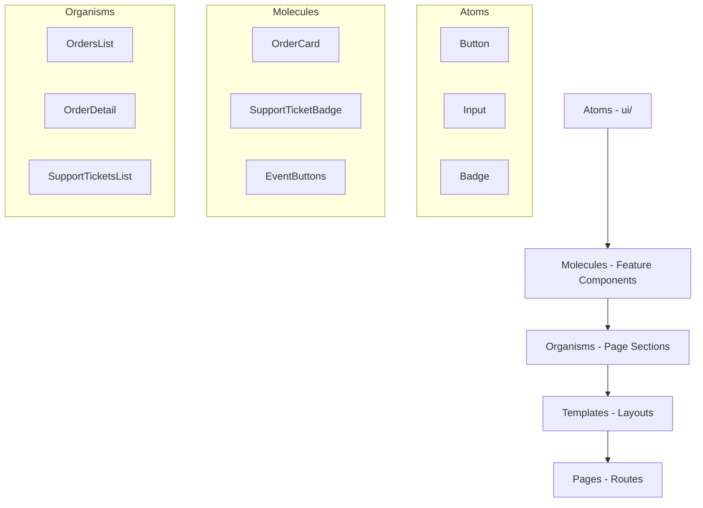
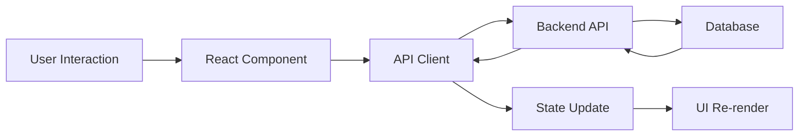

# 💻 Sainapsis Frontend - Next.js Application

> Sistema de gestión de órdenes - Aplicación Frontend con Next.js 15, React 19 y TypeScript

## 📋 Tabla de Contenidos

- [Descripción General](#descripción-general)
- [Stack Tecnológico](#stack-tecnológico)
- [Estructura del Proyecto](#estructura-del-proyecto)
- [Arquitectura de Componentes](#arquitectura-de-componentes)
- [Instalación y Configuración](#instalación-y-configuración)
- [Guía de Desarrollo](#guía-de-desarrollo)
- [Componentes UI](#componentes-ui)
- [Estado y Data Management](#estado-y-data-management)
- [Routing y Navegación](#routing-y-navegación)
- [Styling y Theming](#styling-y-theming)
- [Testing](#testing)
- [Performance](#performance)
- [Deployment](#deployment)
- [Troubleshooting](#troubleshooting)

---

## 📖 Descripción General

Aplicación frontend moderna construida con **Next.js 15** y **React 19** que proporciona una interfaz completa para la gestión de órdenes y tickets de soporte. Utiliza **shadcn/ui** para componentes, **Tailwind CSS** para estilos, y **TypeScript** para type safety.

### 🎯 Características Principales

- ✅ **Next.js 15** con App Router
- ✅ **React 19** con nuevas características
- ✅ **TypeScript** para type safety completo
- ✅ **shadcn/ui** componentes accesibles
- ✅ **Tailwind CSS 4** para styling
- ✅ **Responsive Design** mobile-first
- ✅ **Dark Mode** con next-themes
- ✅ **Form Handling** con React Hook Form + Zod
- ✅ **Real-time Updates** con optimistic updates
- ✅ **Toast Notifications** con Sonner

---

## 🛠️ Stack Tecnológico

### Core Framework
| Tecnología | Versión | Propósito |
|------------|---------|-----------|
| **Next.js** | 15.3.3 | Framework React full-stack |
| **React** | 19.0.0 | Librería UI |
| **TypeScript** | 5.x | Tipado estático |

### UI & Styling
| Tecnología | Versión | Propósito |
|------------|---------|-----------|
| **Tailwind CSS** | 4.x | Framework CSS utility-first |
| **shadcn/ui** | Latest | Sistema de componentes |
| **Radix UI** | Latest | Primitivas UI accesibles |
| **Lucide React** | 0.514.0 | Librería de iconos |
| **next-themes** | 0.4.6 | Soporte para temas |

### Data & Forms
| Tecnología | Versión | Propósito |
|------------|---------|-----------|
| **Axios** | 1.9.0 | Cliente HTTP |
| **React Hook Form** | 7.57.0 | Manejo de formularios |
| **Zod** | 3.25.63 | Validación de esquemas |
| **@hookform/resolvers** | 5.1.1 | Integración Zod + RHF |

### Utilities
| Tecnología | Versión | Propósito |
|------------|---------|-----------|
| **date-fns** | 4.1.0 | Manipulación de fechas |
| **Sonner** | 2.0.5 | Sistema de notificaciones |
| **clsx** | 2.1.1 | Utilidad para clases CSS |
| **tailwind-merge** | 3.3.1 | Merge inteligente de clases |
| **class-variance-authority** | 0.7.1 | Variantes de componentes |

---

## 📁 Estructura del Proyecto

```
src/
├── app/                          # 📱 Next.js App Router
│   ├── globals.css              # Estilos globales
│   ├── layout.tsx               # Layout principal
│   ├── page.tsx                 # Dashboard principal
│   ├── loading.tsx              # Loading UI global
│   ├── error.tsx                # Error UI global
│   ├── not-found.tsx            # 404 page
│   │
│   ├── orders/                  # 📦 Módulo de Órdenes
│   │   ├── page.tsx            # Lista de órdenes
│   │   ├── loading.tsx         # Loading state
│   │   ├── create/
│   │   │   └── page.tsx        # Crear orden
│   │   └── [id]/
│   │       ├── page.tsx        # Detalle de orden
│   │       └── loading.tsx     # Loading state
│   │
│   └── support/                 # 🎫 Módulo de Support
│       ├── page.tsx            # Lista de tickets
│       ├── loading.tsx         # Loading state
│       └── [id]/
│           ├── page.tsx        # Detalle de ticket
│           └── loading.tsx     # Loading state
│
├── components/                   # 🧩 React Components
│   ├── ui/                      # Componentes Base (shadcn/ui)
│   │   ├── button.tsx
│   │   ├── card.tsx
│   │   ├── input.tsx
│   │   ├── select.tsx
│   │   ├── badge.tsx
│   │   ├── alert.tsx
│   │   ├── skeleton.tsx
│   │   ├── separator.tsx
│   │   ├── textarea.tsx
│   │   └── label.tsx
│   │
│   ├── orders/                  # Componentes de Órdenes
│   │   ├── OrderStateBadge.tsx
│   │   ├── OrderCard.tsx
│   │   ├── OrderHistory.tsx
│   │   ├── EventButtons.tsx
│   │   └── OrderSupportTickets.tsx
│   │
│   ├── support/                 # Componentes de Support
│   │   ├── SupportTicketBadge.tsx
│   │   ├── SupportTicketCard.tsx
│   │   └── TicketStatusSelect.tsx
│   │
│   └── layout/                  # Componentes de Layout
│       ├── Header.tsx
│       ├── Sidebar.tsx
│       ├── Footer.tsx
│       └── ThemeToggle.tsx
│
├── lib/                         # 📚 Utilities & Configuration
│   ├── api.ts                  # Cliente API (Axios)
│   ├── types.ts                # Definiciones TypeScript
│   ├── constants.ts            # Constantes de la aplicación
│   ├── utils.ts                # Funciones utilitarias
│   └── validations.ts          # Esquemas de validación (Zod)
│
├── hooks/                       # 🎣 Custom React Hooks
│   ├── use-orders.ts           # Hook para órdenes
│   ├── use-support-tickets.ts  # Hook para tickets
│   └── use-local-storage.ts    # Hook para localStorage
│
└── styles/                      # 🎨 Archivos de estilo
    └── globals.css             # Estilos globales adicionales
```

---

## 🏗️ Arquitectura de Componentes

### Atomic Design Pattern



### Flujo de Datos



---

## ⚙️ Instalación y Configuración

### Prerrequisitos
- **Node.js** 18.0.0 o superior
- **npm** 9.0.0 o superior (o yarn/pnpm)
- **Git**

### Setup Inicial

1. **Clonar el repositorio**
```bash
git clone <repository-url>
cd sainapsis-frontend
```

2. **Instalar dependencias**
```bash
npm install
# o
yarn install
# o
pnpm install
```

3. **Configurar variables de entorno**
```bash
# .env.local
NEXT_PUBLIC_API_URL=http://localhost:8000

# Opcional: para desarrollo
NEXT_PUBLIC_APP_ENV=development
NEXT_PUBLIC_DEBUG=true
```

4. **Iniciar servidor de desarrollo**
```bash
npm run dev
# o
yarn dev
# o
pnpm dev
```

5. **Abrir en navegador**
```
http://localhost:3000
```

### Scripts Disponibles

```json
{
  "dev": "next dev",           // Servidor de desarrollo
  "build": "next build",       // Build de producción
  "start": "next start",       // Servidor de producción
  "lint": "next lint",         // Linting con ESLint
  "type-check": "tsc --noEmit" // Verificación de tipos
}
```

---

## 👨‍💻 Guía de Desarrollo

### Convenciones de Código

#### Naming Conventions
```typescript
// Componentes: PascalCase
export function OrderCard() {}

// Hooks: camelCase con prefijo 'use'
export function useOrders() {}

// Tipos: PascalCase
interface OrderState {}
type EventType = string

// Constantes: UPPER_SNAKE_CASE
const API_ENDPOINTS = {}

// Archivos: kebab-case
order-card.tsx
support-ticket-badge.tsx
```

#### Component Structure
```typescript
'use client' // Para client components

import { useState, useEffect } from 'react'
import { Card, CardContent, CardHeader, CardTitle } from '@/components/ui/card'
import { Button } from '@/components/ui/button'
import { Order } from '@/lib/types'

interface OrderCardProps {
  order: Order
  onUpdate?: (order: Order) => void
}

export function OrderCard({ order, onUpdate }: OrderCardProps) {
  // 1. Hooks
  const [loading, setLoading] = useState(false)
  
  // 2. Effects
  useEffect(() => {
    // Effect logic
  }, [])
  
  // 3. Event handlers
  const handleUpdate = () => {
    // Handler logic
  }
  
  // 4. Render
  return (
    <Card>
      <CardHeader>
        <CardTitle>Order #{order.id.slice(-8)}</CardTitle>
      </CardHeader>
      <CardContent>
        <Button onClick={handleUpdate}>
          Update Order
        </Button>
      </CardContent>
    </Card>
  )
}
```

### Creación de Nuevos Componentes

#### 1. Crear Componente UI Base
```bash
# Usar shadcn/ui CLI
npx shadcn-ui@latest add button
npx shadcn-ui@latest add card
npx shadcn-ui@latest add input
```

#### 2. Crear Componente Feature
```typescript
// components/orders/NewOrderComponent.tsx
'use client'

import { Card } from '@/components/ui/card'
import { Order } from '@/lib/types'

interface NewOrderComponentProps {
  orders: Order[]
}

export function NewOrderComponent({ orders }: NewOrderComponentProps) {
  return (
    <div className="grid grid-cols-1 md:grid-cols-2 lg:grid-cols-3 gap-6">
      {orders.map((order) => (
        <Card key={order.id}>
          {/* Component content */}
        </Card>
      ))}
    </div>
  )
}
```

#### 3. Crear Página
```typescript
// app/new-page/page.tsx
import { NewOrderComponent } from '@/components/orders/NewOrderComponent'

export default function NewPage() {
  return (
    <div className="container mx-auto px-4 py-6">
      <h1 className="text-3xl font-bold mb-6">New Page</h1>
      <NewOrderComponent orders={[]} />
    </div>
  )
}
```

---

## 🎨 Componentes UI

### shadcn/ui Components

#### Instalados y Configurados
```typescript
// Componentes disponibles
import { Button } from '@/components/ui/button'
import { Card, CardContent, CardHeader, CardTitle } from '@/components/ui/card'
import { Input } from '@/components/ui/input'
import { Select, SelectContent, SelectItem, SelectTrigger, SelectValue } from '@/components/ui/select'
import { Badge } from '@/components/ui/badge'
import { Alert, AlertDescription } from '@/components/ui/alert'
import { Skeleton } from '@/components/ui/skeleton'
import { Separator } from '@/components/ui/separator'
import { Textarea } from '@/components/ui/textarea'
import { Label } from '@/components/ui/label'
```

#### Ejemplos de Uso

**Button Variants**
```typescript
<Button variant="default">Default</Button>
<Button variant="destructive">Delete</Button>
<Button variant="outline">Outline</Button>
<Button variant="secondary">Secondary</Button>
<Button variant="ghost">Ghost</Button>
<Button variant="link">Link</Button>
```

**Card Component**
```typescript
<Card>
  <CardHeader>
    <CardTitle>Order Details</CardTitle>
    <CardDescription>View and manage order information</CardDescription>
  </CardHeader>
  <CardContent>
    <p>Order content here...</p>
  </CardContent>
</Card>
```

**Form Components**
```typescript
<div className="space-y-4">
  <div className="space-y-2">
    <Label htmlFor="email">Email</Label>
    <Input id="email" type="email" placeholder="Enter email" />
  </div>
  
  <div className="space-y-2">
    <Label htmlFor="status">Status</Label>
    <Select>
      <SelectTrigger>
        <SelectValue placeholder="Select status" />
      </SelectTrigger>
      <SelectContent>
        <SelectItem value="pending">Pending</SelectItem>
        <SelectItem value="confirmed">Confirmed</SelectItem>
      </SelectContent>
    </Select>
  </div>
</div>
```

### Custom Components

#### OrderStateBadge
```typescript
interface OrderStateBadgeProps {
  state: OrderState
  className?: string
}

export function OrderStateBadge({ state, className }: OrderStateBadgeProps) {
  const config = ORDER_STATE_CONFIG[state]
  
  return (
    <Badge className={`${config.color} ${className || ''}`}>
      <span className="mr-1">{config.icon}</span>
      {config.label}
    </Badge>
  )
}
```

#### SupportTicketBadge
```typescript
interface SupportTicketBadgeProps {
  status: SupportTicketStatus
  className?: string
}

export function SupportTicketBadge({ status, className }: SupportTicketBadgeProps) {
  const config = SUPPORT_TICKET_STATUS_CONFIG[status]
  
  return (
    <Badge className={`${config.color} ${className || ''}`}>
      <span className="mr-1">{config.icon}</span>
      {config.label}
    </Badge>
  )
}
```

---

## 📊 Estado y Data Management

### API Client (Axios)

#### Configuración Base
```typescript
// lib/api.ts
import axios, { AxiosResponse } from 'axios'

const api = axios.create({
  baseURL: process.env.NEXT_PUBLIC_API_URL || 'http://localhost:8000',
  headers: {
    'Content-Type': 'application/json',
  },
  timeout: 10000,
})

// Interceptors para logging
api.interceptors.request.use(
  (config) => {
    console.log(`🔄 API Request: ${config.method?.toUpperCase()} ${config.url}`)
    return config
  }
)

api.interceptors.response.use(
  (response) => {
    console.log(`✅ API Response: ${response.status}`)
    return response
  },
  (error) => {
    console.error('❌ API Error:', error.response?.data || error.message)
    return Promise.reject(error)
  }
)
```

#### API Methods
```typescript
// Orders API
export const orderApi = {
  getAll: (): Promise<AxiosResponse<Order[]>> => 
    api.get('/orders'),
    
  getById: (id: string): Promise<AxiosResponse<Order>> => 
    api.get(`/orders/${id}`),
    
  create: (data: CreateOrderRequest): Promise<AxiosResponse<Order>> => 
    api.post('/orders', data),
    
  processEvent: (id: string, data: ProcessEventRequest): Promise<AxiosResponse<EventResponse>> => 
    api.post(`/orders/${id}/events`, data),
}

// Support API
export const supportApi = {
  getAll: (): Promise<AxiosResponse<SupportTicket[]>> => 
    api.get('/support/tickets'),
    
  updateStatus: (id: string, data: UpdateTicketStatusRequest): Promise<AxiosResponse<UpdateTicketStatusResponse>> => 
    api.patch(`/support/tickets/${id}/status`, data),
}
```

### Custom Hooks

#### useOrders Hook
```typescript
// hooks/use-orders.ts
import { useState, useEffect } from 'react'
import { orderApi } from '@/lib/api'
import { Order } from '@/lib/types'

export function useOrders() {
  const [orders, setOrders] = useState<Order[]>([])
  const [loading, setLoading] = useState(true)
  const [error, setError] = useState<string | null>(null)

  const fetchOrders = async () => {
    try {
      setLoading(true)
      setError(null)
      const response = await orderApi.getAll()
      setOrders(response.data)
    } catch (err) {
      setError(err instanceof Error ? err.message : 'An error occurred')
    } finally {
      setLoading(false)
    }
  }

  useEffect(() => {
    fetchOrders()
  }, [])

  const refetch = () => {
    fetchOrders()
  }

  return {
    orders,
    loading,
    error,
    refetch
  }
}
```

#### useSupportTickets Hook
```typescript
// hooks/use-support-tickets.ts
export function useSupportTickets(orderId?: string) {
  const [tickets, setTickets] = useState<SupportTicket[]>([])
  const [loading, setLoading] = useState(true)

  useEffect(() => {
    const fetchTickets = async () => {
      try {
        setLoading(true)
        const response = orderId 
          ? await supportApi.getByOrderId(orderId)
          : await supportApi.getAll()
        setTickets(response.data)
      } catch (error) {
        console.error('Error fetching tickets:', error)
      } finally {
        setLoading(false)
      }
    }

    fetchTickets()
  }, [orderId])

  return { tickets, loading, refetch: () => fetchTickets() }
}
```

### State Management Patterns

#### Local State (useState)
```typescript
const [orders, setOrders] = useState<Order[]>([])
const [loading, setLoading] = useState(false)
const [selectedOrder, setSelectedOrder] = useState<Order | null>(null)
```

#### Form State (React Hook Form + Zod)
```typescript
import { useForm } from 'react-hook-form'
import { zodResolver } from '@hookform/resolvers/zod'
import { z } from 'zod'

const orderSchema = z.object({
  product_ids: z.array(z.string()).min(1),
  amount: z.number().positive(),
  metadata: z.object({}).optional()
})

type OrderFormData = z.infer<typeof orderSchema>

export function CreateOrderForm() {
  const form = useForm<OrderFormData>({
    resolver: zodResolver(orderSchema),
    defaultValues: {
      product_ids: [],
      amount: 0,
      metadata: {}
    }
  })

  const onSubmit = async (data: OrderFormData) => {
    try {
      await orderApi.create(data)
      // Handle success
    } catch (error) {
      // Handle error
    }
  }

  return (
    <form onSubmit={form.handleSubmit(onSubmit)}>
      {/* Form fields */}
    </form>
  )
}
```

---

## 🚦 Routing y Navegación

### App Router Structure

```
app/
├── page.tsx              # / (Dashboard)
├── layout.tsx            # Root layout
├── loading.tsx           # Global loading UI
├── error.tsx             # Global error UI
├── not-found.tsx         # 404 page
│
├── orders/
│   ├── page.tsx          # /orders (Orders list)
│   ├── loading.tsx       # Loading UI
│   ├── create/
│   │   └── page.tsx      # /orders/create
│   └── [id]/
│       ├── page.tsx      # /orders/[id] (Order detail)
│       └── loading.tsx   # Loading UI
│
└── support/
    ├── page.tsx          # /support (Support tickets list)
    ├── loading.tsx       # Loading UI
    └── [id]/
        ├── page.tsx      # /support/[id] (Ticket detail)
        └── loading.tsx   # Loading UI
```

### Navigation Components

#### Header with Navigation
```typescript
// components/layout/Header.tsx
import Link from 'next/link'
import { usePathname } from 'next/navigation'

export function Header() {
  const pathname = usePathname()

  return (
    <header className="border-b">
      <nav className="container mx-auto px-4 py-4">
        <div className="flex items-center justify-between">
          <Link href="/" className="text-xl font-bold">
            Sainapsis
          </Link>
          
          <div className="flex items-center space-x-6">
            <Link 
              href="/orders" 
              className={pathname.startsWith('/orders') ? 'text-blue-600' : 'text-gray-600'}
            >
              Orders
            </Link>
            <Link 
              href="/support" 
              className={pathname.startsWith('/support') ? 'text-blue-600' : 'text-gray-600'}
            >
              Support
            </Link>
          </div>
        </div>
      </nav>
    </header>
  )
}
```

#### Programmatic Navigation
```typescript
import { useRouter } from 'next/navigation'

export function OrderCard({ order }: { order: Order }) {
  const router = useRouter()

  const handleViewDetails = () => {
    router.push(`/orders/${order.id}`)
  }

  const handleGoBack = () => {
    router.back()
  }

  return (
    <Card>
      <CardContent>
        <Button onClick={handleViewDetails}>View Details</Button>
        <Button onClick={handleGoBack} variant="outline">Back</Button>
      </CardContent>
    </Card>
  )
}
```

---

## 🎨 Styling y Theming

### Tailwind CSS Configuration

```typescript
// tailwind.config.ts
import type { Config } from 'tailwindcss'

const config: Config = {
  darkMode: ['class'],
  content: [
    './src/pages/**/*.{js,ts,jsx,tsx,mdx}',
    './src/components/**/*.{js,ts,jsx,tsx,mdx}',
    './src/app/**/*.{js,ts,jsx,tsx,mdx}',
  ],
  theme: {
    extend: {
      colors: {
        border: 'hsl(var(--border))',
        input: 'hsl(var(--input))',
        ring: 'hsl(var(--ring))',
        background: 'hsl(var(--background))',
        foreground: 'hsl(var(--foreground))',
        primary: {
          DEFAULT: 'hsl(var(--primary))',
          foreground: 'hsl(var(--primary-foreground))',
        },
        secondary: {
          DEFAULT: 'hsl(var(--secondary))',
          foreground: 'hsl(var(--secondary-foreground))',
        },
        destructive: {
          DEFAULT: 'hsl(var(--destructive))',
          foreground: 'hsl(var(--destructive-foreground))',
        },
        muted: {
          DEFAULT: 'hsl(var(--muted))',
          foreground: 'hsl(var(--muted-foreground))',
        },
        accent: {
          DEFAULT: 'hsl(var(--accent))',
          foreground: 'hsl(var(--accent-foreground))',
        },
        popover: {
          DEFAULT: 'hsl(var(--popover))',
          foreground: 'hsl(var(--popover-foreground))',
        },
        card: {
          DEFAULT: 'hsl(var(--card))',
          foreground: 'hsl(var(--card-foreground))',
        },
      },
      borderRadius: {
        lg: 'var(--radius)',
        md: 'calc(var(--radius) - 2px)',
        sm: 'calc(var(--radius) - 4px)',
      },
    },
  },
  plugins: [require('tailwindcss-animate')],
}

export default config
```

### Dark Mode Implementation

```typescript
// components/layout/ThemeToggle.tsx
'use client'

import { useTheme } from 'next-themes'
import { Button } from '@/components/ui/button'
import { Moon, Sun } from 'lucide-react'

export function ThemeToggle() {
  const { theme, setTheme } = useTheme()

  return (
    <Button
      variant="outline"
      size="icon"
      onClick={() => setTheme(theme === 'light' ? 'dark' : 'light')}
    >
      <Sun className="h-[1.2rem] w-[1.2rem] rotate-0 scale-100 transition-all dark:-rotate-90 dark:scale-0" />
      <Moon className="absolute h-[1.2rem] w-[1.2rem] rotate-90 scale-0 transition-all dark:rotate-0 dark:scale-100" />
      <span className="sr-only">Toggle theme</span>
    </Button>
  )
}
```

### Custom CSS Classes

```css
/* app/globals.css */
@tailwind base;
@tailwind components;
@tailwind utilities;

@layer base {
  :root {
    --background: 0 0% 100%;
    --foreground: 222.2 84% 4.9%;
    --card: 0 0% 100%;
    --card-foreground: 222.2 84% 4.9%;
    --popover: 0 0% 100%;
    --popover-foreground: 222.2 84% 4.9%;
    --primary: 222.2 47.4% 11.2%;
    --primary-foreground: 210 40% 98%;
    --secondary: 210 40% 96%;
    --secondary-foreground: 222.2 47.4% 11.2%;
    --muted: 210 40% 96%;
    --muted-foreground: 215.4 16.3% 46.9%;
    --accent: 210 40% 96%;
    --accent-foreground: 222.2 47.4% 11.2%;
    --destructive: 0 84.2% 60.2%;
    --destructive-foreground: 210 40% 98%;
    --border: 214.3 31.8% 91.4%;
    --input: 214.3 31.8% 91.4%;
    --ring: 222.2 84% 4.9%;
    --radius: 0.5rem;
  }

  .dark {
    --background: 222.2 84% 4.9%;
    --foreground: 210 40% 98%;
    --card: 222.2 84% 4.9%;
    --card-foreground: 210 40% 98%;
    --popover: 222.2 84% 4.9%;
    --popover-foreground: 210 40% 98%;
    --primary: 210 40% 98%;
    --primary-foreground: 222.2 47.4% 11.2%;
    --secondary: 217.2 32.6% 17.5%;
    --secondary-foreground: 210 40% 98%;
    --muted: 217.2 32.6% 17.5%;
    --muted-foreground: 215 20.2% 65.1%;
    --accent: 217.2 32.6% 17.5%;
    --accent-foreground: 210 40% 98%;
    --destructive: 0 62.8% 30.6%;
    --destructive-foreground: 210 40% 98%;
    --border: 217.2 32.6% 17.5%;
    --input: 217.2 32.6% 17.5%;
    --ring: 212.7 26.8% 83.9%;
  }
}

@layer utilities {
  .line-clamp-2 {
    overflow: hidden;
    display: -webkit-box;
    -webkit-box-orient: vertical;
    -webkit-line-clamp: 2;
  }
}
```

---

## 🧪 Testing

### Testing Setup

```bash
# Instalar dependencias de testing
npm install --save-dev @testing-library/react @testing-library/jest-dom jest-environment-jsdom
```

### Component Testing

```typescript
// __tests__/components/OrderCard.test.tsx
import { render, screen } from '@testing-library/react'
import { OrderCard } from '@/components/orders/OrderCard'
import { Order } from '@/lib/types'

const mockOrder: Order = {
  id: 'test-id',
  product_ids: ['LAPTOP-001'],
  amount: 1299.99,
  state: 'pending',
  metadata: {},
  created_at: '2025-01-01T00:00:00Z',
  updated_at: '2025-01-01T00:00:00Z'
}

describe('OrderCard', () => {
  it('renders order information correctly', () => {
    render(<OrderCard order={mockOrder} />)
    
    expect(screen.getByText('#test-id')).toBeInTheDocument()
    expect(screen.getByText('$1,299.99')).toBeInTheDocument()
    expect(screen.getByText('Pending')).toBeInTheDocument()
  })
})
```

### API Testing

```typescript
// __tests__/lib/api.test.ts
import { orderApi } from '@/lib/api'

// Mock axios
jest.mock('axios')

describe('orderApi', () => {
  it('fetches orders successfully', async () => {
    const mockOrders = [mockOrder]
    axios.get.mockResolvedValue({ data: mockOrders })

    const result = await orderApi.getAll()
    
    expect(result.data).toEqual(mockOrders)
    expect(axios.get).toHaveBeenCalledWith('/orders')
  })
})
```

---

## ⚡ Performance

### Optimización de Imágenes

```typescript
import Image from 'next/image'

export function ProductImage({ src, alt }: { src: string, alt: string }) {
  return (
    <Image
      src={src}
      alt={alt}
      width={300}
      height={200}
      className="rounded-lg"
      priority // Para imágenes above-the-fold
    />
  )
}
```

### Code Splitting

```typescript
// Lazy loading de componentes
import { lazy, Suspense } from 'react'
import { Skeleton } from '@/components/ui/skeleton'

const OrderHistory = lazy(() => import('@/components/orders/OrderHistory'))

export function OrderDetail() {
  return (
    <div>
      <Suspense fallback={<Skeleton className="h-32 w-full" />}>
        <OrderHistory />
      </Suspense>
    </div>
  )
}
```

### Bundle Analysis

```bash
# Analizar bundle
npm install --save-dev @next/bundle-analyzer

# next.config.js
const withBundleAnalyzer = require('@next/bundle-analyzer')({
  enabled: process.env.ANALYZE === 'true',
})

module.exports = withBundleAnalyzer({
  // Next.js config
})

# Ejecutar análisis
ANALYZE=true npm run build
```

---

## 🚀 Deployment

### Vercel Deployment

```bash
# Instalar Vercel CLI
npm i -g vercel

# Deploy
vercel

# Production deployment
vercel --prod
```

### Environment Variables (Vercel)

```bash
# En Vercel Dashboard o CLI
vercel env add NEXT_PUBLIC_API_URL production
```

### Build Optimization

```typescript
// next.config.ts
import type { NextConfig } from 'next'

const nextConfig: NextConfig = {
  output: 'standalone', // Para Docker
  images: {
    domains: ['your-api-domain.com'],
  },
  experimental: {
    optimizeCss: true,
  },
}

export default nextConfig
```

### Docker Deployment

```dockerfile
# Dockerfile
FROM node:18-alpine AS deps
WORKDIR /app
COPY package.json package-lock.json ./
RUN npm ci --only=production

FROM node:18-alpine AS builder
WORKDIR /app
COPY . .
COPY --from=deps /app/node_modules ./node_modules
RUN npm run build

FROM node:18-alpine AS runner
WORKDIR /app
ENV NODE_ENV production
COPY --from=builder /app/public ./public
COPY --from=builder /app/.next/standalone ./
COPY --from=builder /app/.next/static ./.next/static

EXPOSE 3000
ENV PORT 3000

CMD ["node", "server.js"]
```

---

## 🔧 Troubleshooting

### Problemas Comunes

#### Error: Module not found
```bash
# Limpiar cache de Next.js
rm -rf .next
npm run dev
```

#### Error: Type errors in production build
```bash
# Verificar tipos antes del build
npm run type-check
```

#### Error: Hydration mismatch
```typescript
// Usar useEffect para contenido que cambia
import { useEffect, useState } from 'react'

export function ClientOnlyComponent() {
  const [mounted, setMounted] = useState(false)

  useEffect(() => {
    setMounted(true)
  }, [])

  if (!mounted) {
    return null
  }

  return <div>Client-only content</div>
}
```

### Debugging

#### Logs de Desarrollo
```typescript
// Usar console.log con contexto
console.log('🔄 Fetching orders:', { page, filters })
console.log('✅ Orders loaded:', orders.length)
console.error('❌ API Error:', error)
```

#### React DevTools
- Instalar React Developer Tools
- Usar Profiler para performance
- Inspeccionar estado de componentes

### Performance Issues

#### Large Bundle Size
```bash
# Analizar bundle
npm run build
npm run analyze

# Optimizar imports
import { Button } from '@/components/ui/button' // ✅ Specific import
import * as UI from '@/components/ui' // ❌ Avoid namespace imports
```

#### Slow Page Loads
```typescript
// Usar loading states
export default function OrdersPage() {
  const { orders, loading } = useOrders()

  if (loading) {
    return <OrdersLoadingSkeleton />
  }

  return <OrdersList orders={orders} />
}
```

---

## 📚 Recursos Adicionales

### Documentación Oficial
- [Next.js Documentation](https://nextjs.org/docs)
- [React Documentation](https://react.dev)
- [shadcn/ui Documentation](https://ui.shadcn.com)
- [Tailwind CSS Documentation](https://tailwindcss.com/docs)

### Herramientas Recomendadas
- **VS Code** con extensiones:
  - ES7+ React/Redux/React-Native snippets
  - Tailwind CSS IntelliSense
  - Auto Rename Tag
  - Bracket Pair Colorizer

### Community & Learning
- [Next.js GitHub](https://github.com/vercel/next.js)
- [shadcn/ui GitHub](https://github.com/shadcn-ui/ui)
- [Tailwind CSS Discord](https://discord.gg/7NF8GNe)

---

*Documentación Frontend actualizada: Enero 2025*